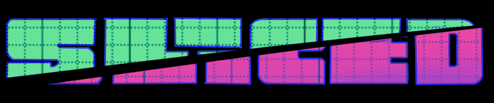

Exploring the data used for Sliced.  See the html version of this page [here](https://jodudding.github.io/sliced/).

[SLICED](https://harsh-walleye-e6e.notion.site/SLICED-Show-c7bd26356e3a42279e2dfbafb0480073) is like the TV Show Chopped but for data science. Competitors get a never-before-seen dataset and two-hours to code a solution to a prediction challenge. Contestants get points for the best model plus bonus points for data visualization, votes from the audience, and more.

[The episodes can be viewed here](https://youtu.be/IObGTduuq2U?si=Cp6oVjxdFQ6XmtTN)

Here are a couple of articles about it:

- [Three reasons to watch #SLICED: A real time data science competition](https://medium.com/data-science/three-reasons-to-watch-sliced-a-real-time-data-science-competition-8d5212ccf988)
- [Data Science Coding Meets Esports](https://towardsdatascience.com/data-science-coding-meets-esports-9439d3ecf91e/)

This repo is my attempt to build some models used the SLICED datasets.

# Season 1 - June 2021

# s01e01 Predict the popularity of board games on BoardGameGeek.com

- [Code](s01e01.rmd)
- [HTML Output](s01e01.html)

# s01e02 Predict whether an aircraft strike with wildlife causes damage 

- [Code](s01e02.rmd)
- [HTML Output](s01e02.html)

# s01e03 Predict Super Store profit

- [Code](s01e03.rmd)
- [HTML Output](s01e03.html)

# Kaggle

## Titanic

Also included in the repo is the Kaggle Titanic competition

- [Code](titanic.rmd)
- [HTML Output](titanic.html)