<style type="text/css">
h1, h2, h3, h4, h5, h6, legend {
  color: #302df0;
}

h1.title {
    font-size: 38px;
    background-color: #e946a5;
    color: #ffffff;
    margin-bottom: 20px;
    padding: 9.5px;
    padding-top: 20px;
    padding-bottom: 20px;
    border-radius: 10px;
}

pre {
  background-color: #cccccc;
}

a {
  color: #129875;
}

.hljs-comment {
    color: #68e199;
    font-style: 68e199;
}

.list-group-item.active, .list-group-item.active:hover, .list-group-item.active:focus {
    z-index: 2;
    color: #ffffff;
    background-color: #68e199;
    border-color: #68e199;
}
</style>

Predict the popularity of board games on BoardGameGeek.com

[Kaggle link](https://www.kaggle.com/c/sliced-s01e01/overview/description)

[Twitch link](https://www.twitch.tv/nickwan_datasci)

# Load libraries


```r
library(tidyverse)
library(tidymodels)
library(scales)
library(skimr)
library(kableExtra)

# colours
#pal_jo <- c(viridisLite::magma(8)[2:8], "#4C4C53", "#9B9BA8")

pal_sliced <- c(
  '#e946a5', # pink
  '#68e199', # green
  '#302df0', # blue
  '#6a45b0', # purple
  '#129875', # darker green
  '#4f94bf', # lighter blue
  '#b545ab', # darker pink
  '#000000', # black,
  '#cccccc'  #grey
)

title_colour <- pal_sliced[1]
table_colour <- pal_sliced[4]
bar_colour <- pal_sliced[2]
grid_colour <- pal_sliced[9]

theme_set(theme_bw() %+replace%
    theme(
      # align title and caption to the plot not the panel
      plot.title.position = 'plot',
      plot.caption.position = 'plot',
      # change the title and caption to markdown and move them futher from the plot
      plot.title = element_text(
        size = rel(1.3),
        hjust = 0, 
        margin = margin(c(0, 0, 10, 0)),
        colour = title_colour
      ),
      plot.subtitle = element_text(
        size = rel(1.15),
        hjust = 0, 
        margin = margin(c(0, 0, 15, 0))
      ),
      plot.caption = element_text(
        hjust = 1, 
        margin = margin(c(10, 0, 0, 0))
      ),
      # move axis titles to the left/top and change them to markdown
      axis.title = element_text(hjust = 1),
      # allow the axis values to the markdown as well
      axis.text = element_text(),
      # remove the panel border
      panel.border = element_blank(),
      # put in the axis lines with a slightly thicker line than the gridlines
      axis.line = element_line(colour = grid_colour, size = rel(1.5)),
      # make the tickmarks the same colour
      axis.ticks = element_line(colour = grid_colour),
      # facet strip text left aligned with extra space above
      strip.text = element_text(
        hjust = 0, margin = margin(c(10, 0, 0, 0)), colour = title_colour
      ),
      # clear colour and fill for strip
      strip.background = element_rect(colour = NA, fill = NA),
      # dotted gridlines
      panel.grid = element_line(linetype = 'dotted'),
      # ability to use a different colour for the gridlines
      panel.grid.major.x = element_line(colour = grid_colour),
      panel.grid.major.y = element_line(colour = grid_colour),
      panel.grid.minor.x = element_blank(),
      panel.grid.minor.y = element_blank(),
    )
)

scale_y_pct <- function(
  accuracy = 1L, 
  breaks = pretty_breaks(),
  expand = expansion(mult = c(0, .05)),
  ...
) {
  scale_y_continuous(
    labels = scales::percent_format(accuracy = accuracy, big.mark = ","),
    breaks = breaks,
    expand = expand,
    ...
  )
}

scale_y_comma <- function(
  accuracy = 1L, 
  breaks = pretty_breaks(),
  expand = expansion(mult = c(0, .05)),
  ...
) {
  scale_y_continuous(
    labels = scales::comma_format(accuracy = accuracy),
    breaks = breaks,
    expand = expand,
    ...
  )
}

scale_fill_jo <- function(...) {
  scale_fill_manual(values = pal_sliced, ...)
}

scale_fill_discrete <- scale_fill_jo

update_geom_defaults("bar", list(fill = bar_colour))
update_geom_defaults("col", list(fill = bar_colour))
update_geom_defaults("point", list(colour = bar_colour))
update_geom_defaults("line", list(colour = bar_colour))
```


# Read files


```r
to_build <- read_csv("s01e01/train.csv", guess_max = 200000) 
```

```

── Column specification ────────────────────────────────────────────────────────
cols(
  .default = col_character(),
  game_id = col_double(),
  min_players = col_double(),
  max_players = col_double(),
  avg_time = col_double(),
  min_time = col_double(),
  max_time = col_double(),
  year = col_double(),
  geek_rating = col_double(),
  num_votes = col_double(),
  age = col_double(),
  owned = col_double()
)
ℹ Use `spec()` for the full column specifications.
```

```r
to_score <- read_csv("s01e01/test.csv", guess_max = 200000) %>%
  mutate(
    category11 = as.character(category11),
    category12 = as.character(category12)
  )
```

```

── Column specification ────────────────────────────────────────────────────────
cols(
  .default = col_character(),
  game_id = col_double(),
  min_players = col_double(),
  max_players = col_double(),
  avg_time = col_double(),
  min_time = col_double(),
  max_time = col_double(),
  year = col_double(),
  num_votes = col_double(),
  age = col_double(),
  owned = col_double(),
  category11 = col_logical(),
  category12 = col_logical()
)
ℹ Use `spec()` for the full column specifications.
```

# Examine data


```r
skim(to_build)
```


<table style='width: auto;'
        class='table table-condensed'>
<caption>Data summary</caption>
 <thead>
  <tr>
   <th style="text-align:left;">   </th>
   <th style="text-align:left;">   </th>
  </tr>
 </thead>
<tbody>
  <tr>
   <td style="text-align:left;"> Name </td>
   <td style="text-align:left;"> to_build </td>
  </tr>
  <tr>
   <td style="text-align:left;"> Number of rows </td>
   <td style="text-align:left;"> 3499 </td>
  </tr>
  <tr>
   <td style="text-align:left;"> Number of columns </td>
   <td style="text-align:left;"> 26 </td>
  </tr>
  <tr>
   <td style="text-align:left;"> _______________________ </td>
   <td style="text-align:left;">  </td>
  </tr>
  <tr>
   <td style="text-align:left;"> Column type frequency: </td>
   <td style="text-align:left;">  </td>
  </tr>
  <tr>
   <td style="text-align:left;"> character </td>
   <td style="text-align:left;"> 15 </td>
  </tr>
  <tr>
   <td style="text-align:left;"> numeric </td>
   <td style="text-align:left;"> 11 </td>
  </tr>
  <tr>
   <td style="text-align:left;"> ________________________ </td>
   <td style="text-align:left;">  </td>
  </tr>
  <tr>
   <td style="text-align:left;"> Group variables </td>
   <td style="text-align:left;"> None </td>
  </tr>
</tbody>
</table>


**Variable type: character**

<table>
 <thead>
  <tr>
   <th style="text-align:left;"> skim_variable </th>
   <th style="text-align:right;"> n_missing </th>
   <th style="text-align:right;"> complete_rate </th>
   <th style="text-align:right;"> min </th>
   <th style="text-align:right;"> max </th>
   <th style="text-align:right;"> empty </th>
   <th style="text-align:right;"> n_unique </th>
   <th style="text-align:right;"> whitespace </th>
  </tr>
 </thead>
<tbody>
  <tr>
   <td style="text-align:left;"> names </td>
   <td style="text-align:right;"> 0 </td>
   <td style="text-align:right;"> 1.00 </td>
   <td style="text-align:right;"> 1 </td>
   <td style="text-align:right;"> 82 </td>
   <td style="text-align:right;"> 0 </td>
   <td style="text-align:right;"> 3485 </td>
   <td style="text-align:right;"> 0 </td>
  </tr>
  <tr>
   <td style="text-align:left;"> mechanic </td>
   <td style="text-align:right;"> 0 </td>
   <td style="text-align:right;"> 1.00 </td>
   <td style="text-align:right;"> 4 </td>
   <td style="text-align:right;"> 258 </td>
   <td style="text-align:right;"> 0 </td>
   <td style="text-align:right;"> 1758 </td>
   <td style="text-align:right;"> 0 </td>
  </tr>
  <tr>
   <td style="text-align:left;"> category1 </td>
   <td style="text-align:right;"> 0 </td>
   <td style="text-align:right;"> 1.00 </td>
   <td style="text-align:right;"> 4 </td>
   <td style="text-align:right;"> 26 </td>
   <td style="text-align:right;"> 0 </td>
   <td style="text-align:right;"> 78 </td>
   <td style="text-align:right;"> 0 </td>
  </tr>
  <tr>
   <td style="text-align:left;"> category2 </td>
   <td style="text-align:right;"> 611 </td>
   <td style="text-align:right;"> 0.83 </td>
   <td style="text-align:right;"> 4 </td>
   <td style="text-align:right;"> 26 </td>
   <td style="text-align:right;"> 0 </td>
   <td style="text-align:right;"> 81 </td>
   <td style="text-align:right;"> 0 </td>
  </tr>
  <tr>
   <td style="text-align:left;"> category3 </td>
   <td style="text-align:right;"> 1773 </td>
   <td style="text-align:right;"> 0.49 </td>
   <td style="text-align:right;"> 4 </td>
   <td style="text-align:right;"> 26 </td>
   <td style="text-align:right;"> 0 </td>
   <td style="text-align:right;"> 72 </td>
   <td style="text-align:right;"> 0 </td>
  </tr>
  <tr>
   <td style="text-align:left;"> category4 </td>
   <td style="text-align:right;"> 2636 </td>
   <td style="text-align:right;"> 0.25 </td>
   <td style="text-align:right;"> 4 </td>
   <td style="text-align:right;"> 25 </td>
   <td style="text-align:right;"> 0 </td>
   <td style="text-align:right;"> 62 </td>
   <td style="text-align:right;"> 0 </td>
  </tr>
  <tr>
   <td style="text-align:left;"> category5 </td>
   <td style="text-align:right;"> 3098 </td>
   <td style="text-align:right;"> 0.11 </td>
   <td style="text-align:right;"> 4 </td>
   <td style="text-align:right;"> 25 </td>
   <td style="text-align:right;"> 0 </td>
   <td style="text-align:right;"> 45 </td>
   <td style="text-align:right;"> 0 </td>
  </tr>
  <tr>
   <td style="text-align:left;"> category6 </td>
   <td style="text-align:right;"> 3363 </td>
   <td style="text-align:right;"> 0.04 </td>
   <td style="text-align:right;"> 4 </td>
   <td style="text-align:right;"> 25 </td>
   <td style="text-align:right;"> 0 </td>
   <td style="text-align:right;"> 38 </td>
   <td style="text-align:right;"> 0 </td>
  </tr>
  <tr>
   <td style="text-align:left;"> category7 </td>
   <td style="text-align:right;"> 3453 </td>
   <td style="text-align:right;"> 0.01 </td>
   <td style="text-align:right;"> 4 </td>
   <td style="text-align:right;"> 25 </td>
   <td style="text-align:right;"> 0 </td>
   <td style="text-align:right;"> 21 </td>
   <td style="text-align:right;"> 0 </td>
  </tr>
  <tr>
   <td style="text-align:left;"> category8 </td>
   <td style="text-align:right;"> 3480 </td>
   <td style="text-align:right;"> 0.01 </td>
   <td style="text-align:right;"> 5 </td>
   <td style="text-align:right;"> 19 </td>
   <td style="text-align:right;"> 0 </td>
   <td style="text-align:right;"> 14 </td>
   <td style="text-align:right;"> 0 </td>
  </tr>
  <tr>
   <td style="text-align:left;"> category9 </td>
   <td style="text-align:right;"> 3494 </td>
   <td style="text-align:right;"> 0.00 </td>
   <td style="text-align:right;"> 7 </td>
   <td style="text-align:right;"> 19 </td>
   <td style="text-align:right;"> 0 </td>
   <td style="text-align:right;"> 5 </td>
   <td style="text-align:right;"> 0 </td>
  </tr>
  <tr>
   <td style="text-align:left;"> category10 </td>
   <td style="text-align:right;"> 3495 </td>
   <td style="text-align:right;"> 0.00 </td>
   <td style="text-align:right;"> 6 </td>
   <td style="text-align:right;"> 25 </td>
   <td style="text-align:right;"> 0 </td>
   <td style="text-align:right;"> 3 </td>
   <td style="text-align:right;"> 0 </td>
  </tr>
  <tr>
   <td style="text-align:left;"> category11 </td>
   <td style="text-align:right;"> 3498 </td>
   <td style="text-align:right;"> 0.00 </td>
   <td style="text-align:right;"> 9 </td>
   <td style="text-align:right;"> 9 </td>
   <td style="text-align:right;"> 0 </td>
   <td style="text-align:right;"> 1 </td>
   <td style="text-align:right;"> 0 </td>
  </tr>
  <tr>
   <td style="text-align:left;"> category12 </td>
   <td style="text-align:right;"> 3498 </td>
   <td style="text-align:right;"> 0.00 </td>
   <td style="text-align:right;"> 15 </td>
   <td style="text-align:right;"> 15 </td>
   <td style="text-align:right;"> 0 </td>
   <td style="text-align:right;"> 1 </td>
   <td style="text-align:right;"> 0 </td>
  </tr>
  <tr>
   <td style="text-align:left;"> designer </td>
   <td style="text-align:right;"> 0 </td>
   <td style="text-align:right;"> 1.00 </td>
   <td style="text-align:right;"> 4 </td>
   <td style="text-align:right;"> 157 </td>
   <td style="text-align:right;"> 0 </td>
   <td style="text-align:right;"> 1905 </td>
   <td style="text-align:right;"> 0 </td>
  </tr>
</tbody>
</table>


**Variable type: numeric**

<table>
 <thead>
  <tr>
   <th style="text-align:left;"> skim_variable </th>
   <th style="text-align:right;"> n_missing </th>
   <th style="text-align:right;"> complete_rate </th>
   <th style="text-align:right;"> mean </th>
   <th style="text-align:right;"> sd </th>
   <th style="text-align:right;"> p0 </th>
   <th style="text-align:right;"> p25 </th>
   <th style="text-align:right;"> p50 </th>
   <th style="text-align:right;"> p75 </th>
   <th style="text-align:right;"> p100 </th>
   <th style="text-align:left;"> hist </th>
  </tr>
 </thead>
<tbody>
  <tr>
   <td style="text-align:left;"> game_id </td>
   <td style="text-align:right;"> 0 </td>
   <td style="text-align:right;"> 1 </td>
   <td style="text-align:right;"> 89632.37 </td>
   <td style="text-align:right;"> 77040.84 </td>
   <td style="text-align:right;"> 2.00 </td>
   <td style="text-align:right;"> 11164.50 </td>
   <td style="text-align:right;"> 73538.0 </td>
   <td style="text-align:right;"> 160677.0 </td>
   <td style="text-align:right;"> 244522.0 </td>
   <td style="text-align:left;"> ▇▂▃▃▂ </td>
  </tr>
  <tr>
   <td style="text-align:left;"> min_players </td>
   <td style="text-align:right;"> 0 </td>
   <td style="text-align:right;"> 1 </td>
   <td style="text-align:right;"> 2.01 </td>
   <td style="text-align:right;"> 0.67 </td>
   <td style="text-align:right;"> 0.00 </td>
   <td style="text-align:right;"> 2.00 </td>
   <td style="text-align:right;"> 2.0 </td>
   <td style="text-align:right;"> 2.0 </td>
   <td style="text-align:right;"> 8.0 </td>
   <td style="text-align:left;"> ▂▇▁▁▁ </td>
  </tr>
  <tr>
   <td style="text-align:left;"> max_players </td>
   <td style="text-align:right;"> 0 </td>
   <td style="text-align:right;"> 1 </td>
   <td style="text-align:right;"> 5.06 </td>
   <td style="text-align:right;"> 7.24 </td>
   <td style="text-align:right;"> 0.00 </td>
   <td style="text-align:right;"> 4.00 </td>
   <td style="text-align:right;"> 4.0 </td>
   <td style="text-align:right;"> 6.0 </td>
   <td style="text-align:right;"> 200.0 </td>
   <td style="text-align:left;"> ▇▁▁▁▁ </td>
  </tr>
  <tr>
   <td style="text-align:left;"> avg_time </td>
   <td style="text-align:right;"> 0 </td>
   <td style="text-align:right;"> 1 </td>
   <td style="text-align:right;"> 117.24 </td>
   <td style="text-align:right;"> 487.78 </td>
   <td style="text-align:right;"> 0.00 </td>
   <td style="text-align:right;"> 30.00 </td>
   <td style="text-align:right;"> 60.0 </td>
   <td style="text-align:right;"> 120.0 </td>
   <td style="text-align:right;"> 22500.0 </td>
   <td style="text-align:left;"> ▇▁▁▁▁ </td>
  </tr>
  <tr>
   <td style="text-align:left;"> min_time </td>
   <td style="text-align:right;"> 0 </td>
   <td style="text-align:right;"> 1 </td>
   <td style="text-align:right;"> 82.53 </td>
   <td style="text-align:right;"> 214.19 </td>
   <td style="text-align:right;"> 0.00 </td>
   <td style="text-align:right;"> 30.00 </td>
   <td style="text-align:right;"> 45.0 </td>
   <td style="text-align:right;"> 90.0 </td>
   <td style="text-align:right;"> 5400.0 </td>
   <td style="text-align:left;"> ▇▁▁▁▁ </td>
  </tr>
  <tr>
   <td style="text-align:left;"> max_time </td>
   <td style="text-align:right;"> 0 </td>
   <td style="text-align:right;"> 1 </td>
   <td style="text-align:right;"> 116.80 </td>
   <td style="text-align:right;"> 487.84 </td>
   <td style="text-align:right;"> 0.00 </td>
   <td style="text-align:right;"> 30.00 </td>
   <td style="text-align:right;"> 60.0 </td>
   <td style="text-align:right;"> 120.0 </td>
   <td style="text-align:right;"> 22500.0 </td>
   <td style="text-align:left;"> ▇▁▁▁▁ </td>
  </tr>
  <tr>
   <td style="text-align:left;"> year </td>
   <td style="text-align:right;"> 0 </td>
   <td style="text-align:right;"> 1 </td>
   <td style="text-align:right;"> 1996.10 </td>
   <td style="text-align:right;"> 161.95 </td>
   <td style="text-align:right;"> -3000.00 </td>
   <td style="text-align:right;"> 2003.00 </td>
   <td style="text-align:right;"> 2011.0 </td>
   <td style="text-align:right;"> 2015.0 </td>
   <td style="text-align:right;"> 2018.0 </td>
   <td style="text-align:left;"> ▁▁▁▁▇ </td>
  </tr>
  <tr>
   <td style="text-align:left;"> geek_rating </td>
   <td style="text-align:right;"> 0 </td>
   <td style="text-align:right;"> 1 </td>
   <td style="text-align:right;"> 6.09 </td>
   <td style="text-align:right;"> 0.48 </td>
   <td style="text-align:right;"> 5.64 </td>
   <td style="text-align:right;"> 5.73 </td>
   <td style="text-align:right;"> 5.9 </td>
   <td style="text-align:right;"> 6.3 </td>
   <td style="text-align:right;"> 8.5 </td>
   <td style="text-align:left;"> ▇▂▁▁▁ </td>
  </tr>
  <tr>
   <td style="text-align:left;"> num_votes </td>
   <td style="text-align:right;"> 0 </td>
   <td style="text-align:right;"> 1 </td>
   <td style="text-align:right;"> 2006.03 </td>
   <td style="text-align:right;"> 4644.62 </td>
   <td style="text-align:right;"> 62.00 </td>
   <td style="text-align:right;"> 281.00 </td>
   <td style="text-align:right;"> 618.0 </td>
   <td style="text-align:right;"> 1640.0 </td>
   <td style="text-align:right;"> 77423.0 </td>
   <td style="text-align:left;"> ▇▁▁▁▁ </td>
  </tr>
  <tr>
   <td style="text-align:left;"> age </td>
   <td style="text-align:right;"> 0 </td>
   <td style="text-align:right;"> 1 </td>
   <td style="text-align:right;"> 10.43 </td>
   <td style="text-align:right;"> 3.22 </td>
   <td style="text-align:right;"> 0.00 </td>
   <td style="text-align:right;"> 8.00 </td>
   <td style="text-align:right;"> 11.0 </td>
   <td style="text-align:right;"> 12.0 </td>
   <td style="text-align:right;"> 42.0 </td>
   <td style="text-align:left;"> ▃▇▁▁▁ </td>
  </tr>
  <tr>
   <td style="text-align:left;"> owned </td>
   <td style="text-align:right;"> 0 </td>
   <td style="text-align:right;"> 1 </td>
   <td style="text-align:right;"> 3054.96 </td>
   <td style="text-align:right;"> 6369.31 </td>
   <td style="text-align:right;"> 49.00 </td>
   <td style="text-align:right;"> 622.50 </td>
   <td style="text-align:right;"> 1204.0 </td>
   <td style="text-align:right;"> 2723.0 </td>
   <td style="text-align:right;"> 111807.0 </td>
   <td style="text-align:left;"> ▇▁▁▁▁ </td>
  </tr>
</tbody>
</table>

## Target - geek rating


```r
summary(to_build$geek_rating)
```

```
   Min. 1st Qu.  Median    Mean 3rd Qu.    Max. 
  5.640   5.726   5.905   6.088   6.303   8.502 
```

```r
ggplot(to_build, aes(geek_rating)) +
  geom_histogram(binwidth = 0.2) +
  scale_y_comma() +
  labs(title = 'Geek rating', x = NULL, y = NULL, fill = 'Rating > 7')
```

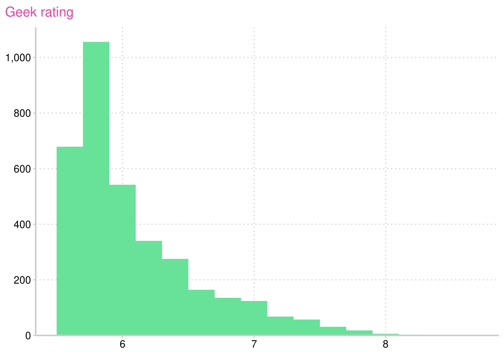

Score over 7 looks good

## Number of players 

- if zero reset to missing and impute
- if over 20 reset to 20


```r
summary(to_build$min_players)
```

```
   Min. 1st Qu.  Median    Mean 3rd Qu.    Max. 
  0.000   2.000   2.000   2.015   2.000   8.000 
```

```r
ggplot(to_build, aes(min_players, fill = geek_rating >= 7)) +
  geom_histogram(binwidth = 1) +
  scale_y_comma() +
  labs(title = 'Min players', x = NULL, y = NULL, fill = 'Rating > 7')
```

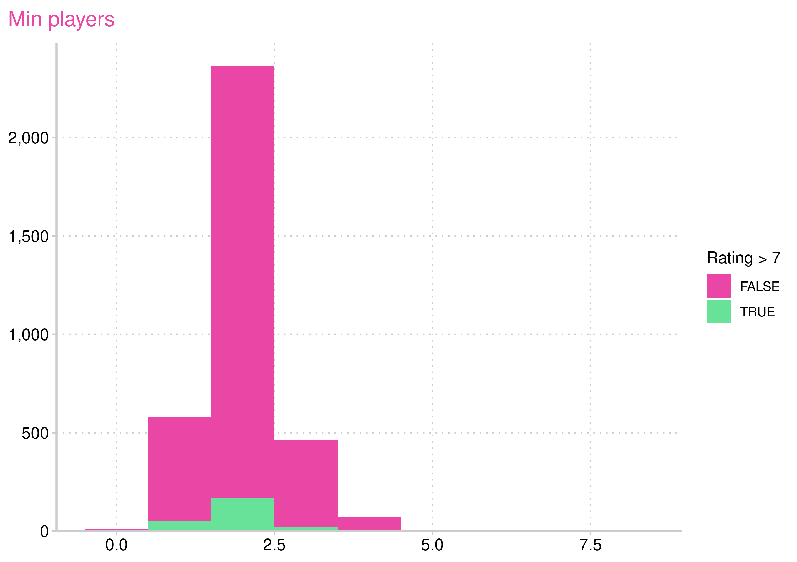

```r
ggplot(to_build, aes(min_players, fill = geek_rating >= 7)) +
  geom_histogram(binwidth = 1, position = 'fill') +
  scale_y_pct() +
  labs(title = 'Min players', x = NULL, y = NULL, fill = 'Rating > 7')
```

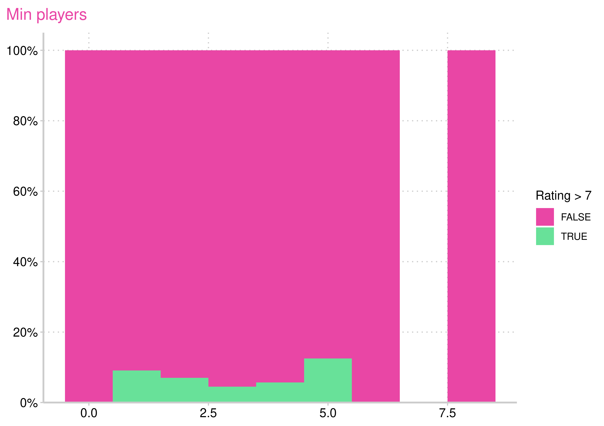

```r
summary(to_build$max_players)
```

```
   Min. 1st Qu.  Median    Mean 3rd Qu.    Max. 
  0.000   4.000   4.000   5.061   6.000 200.000 
```

```r
ggplot(to_build, aes(max_players, fill = geek_rating >= 7)) +
  geom_histogram(binwidth = 1) +
  xlim(0, 20) +
  scale_y_comma() +
  labs(title = 'Max players', x = NULL, y = NULL, fill = 'Rating > 7')
```

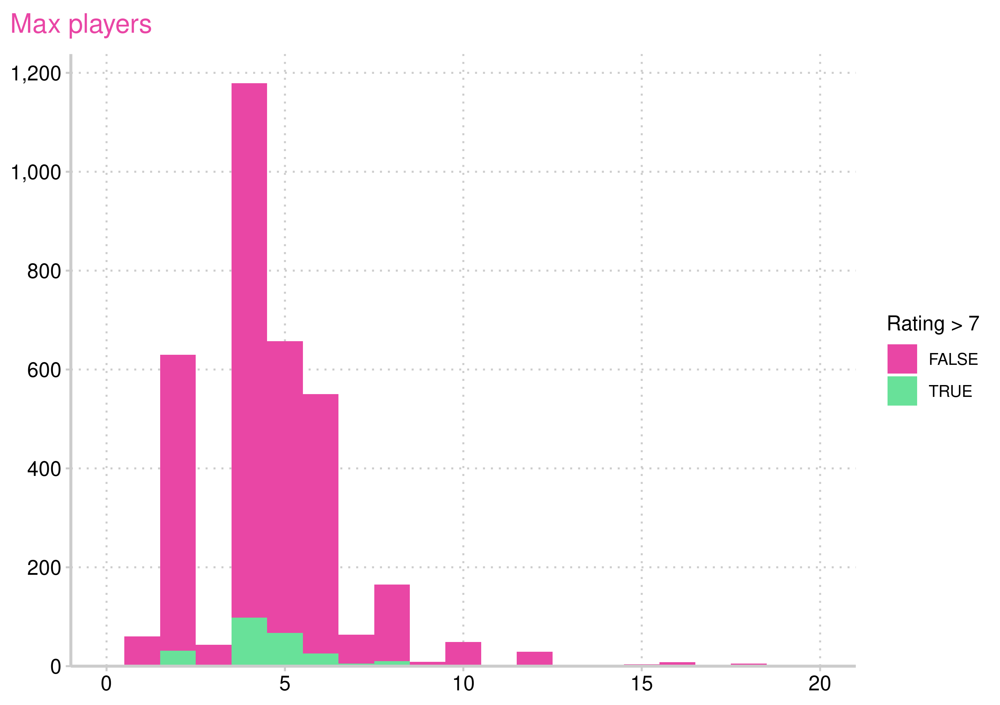

```r
ggplot(to_build, aes(max_players, fill = geek_rating >= 7)) +
  geom_histogram(binwidth = 1, position = 'fill') +
  xlim(0, 20) +
  scale_y_pct() +
  labs(title = 'Max players', x = NULL, y = NULL, fill = 'Rating > 7')
```

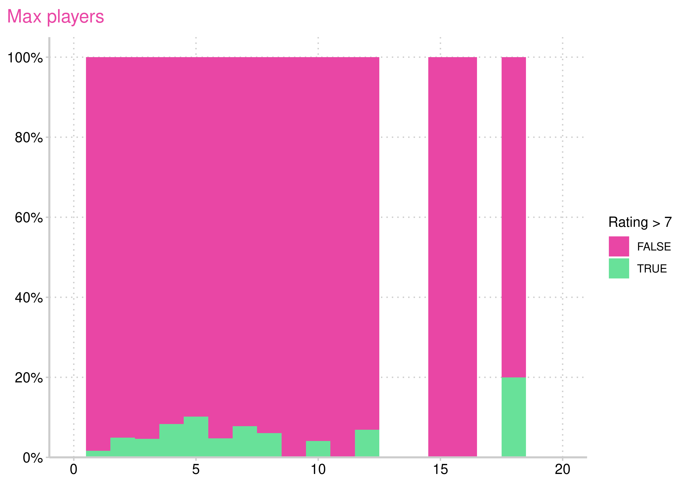

## Year

- if zero then impute
- otherwise if < 1900 then set to 1900


```r
summary(to_build$year)
```

```
   Min. 1st Qu.  Median    Mean 3rd Qu.    Max. 
  -3000    2003    2011    1996    2015    2018 
```

```r
ggplot(to_build, aes(year, fill = geek_rating >= 7)) +
  geom_histogram(binwidth = 10) +
  scale_y_comma() +
  labs(title = 'Year', x = NULL, y = NULL, fill = 'Rating > 7')
```

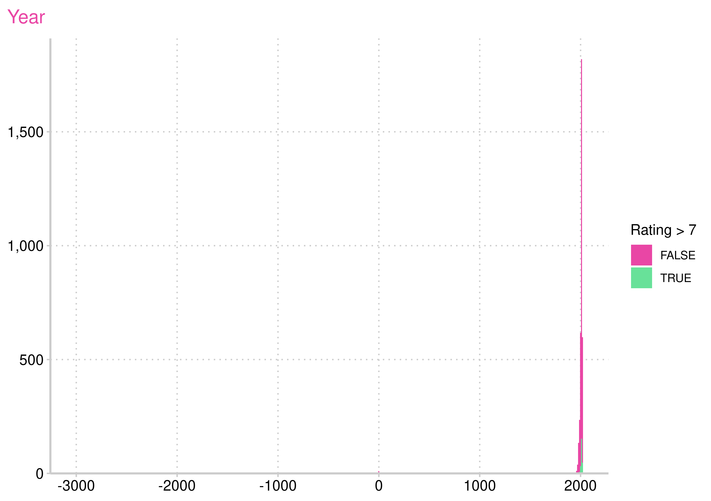

```r
to_build %>%
  filter(year < 0) %>%
  arrange(year) %>%
  select(names, year) %>%
  kable( 
    escape = FALSE,
    padding = 5
  ) %>% 
  kable_styling(
    bootstrap_options = c("striped", "hover"), 
    fixed_thead = TRUE, 
    position = "left"
  ) %>%
  row_spec(0, color = "white", background = table_colour)
```

<table class="table table-striped table-hover" style="">
 <thead>
  <tr>
   <th style="text-align:left;position: sticky; top:0; background-color: #FFFFFF;color: white !important;background-color: #6a45b0 !important;"> names </th>
   <th style="text-align:right;position: sticky; top:0; background-color: #FFFFFF;color: white !important;background-color: #6a45b0 !important;"> year </th>
  </tr>
 </thead>
<tbody>
  <tr>
   <td style="text-align:left;"> Backgammon </td>
   <td style="text-align:right;"> -3000 </td>
  </tr>
  <tr>
   <td style="text-align:left;"> Go </td>
   <td style="text-align:right;"> -2200 </td>
  </tr>
</tbody>
</table>

```r
to_build %>%
  filter(year >= 0 & year < 1900) %>%
  count(year) %>%
  kable( 
    escape = FALSE,
    padding = 5
  ) %>% 
  kable_styling(
    bootstrap_options = c("striped", "hover"), 
    fixed_thead = TRUE, 
    position = "left"
  ) %>%
  row_spec(0, color = "white", background = table_colour)
```

<table class="table table-striped table-hover" style="">
 <thead>
  <tr>
   <th style="text-align:right;position: sticky; top:0; background-color: #FFFFFF;color: white !important;background-color: #6a45b0 !important;"> year </th>
   <th style="text-align:right;position: sticky; top:0; background-color: #FFFFFF;color: white !important;background-color: #6a45b0 !important;"> n </th>
  </tr>
 </thead>
<tbody>
  <tr>
   <td style="text-align:right;"> 0 </td>
   <td style="text-align:right;"> 10 </td>
  </tr>
  <tr>
   <td style="text-align:right;"> 400 </td>
   <td style="text-align:right;"> 1 </td>
  </tr>
  <tr>
   <td style="text-align:right;"> 550 </td>
   <td style="text-align:right;"> 1 </td>
  </tr>
  <tr>
   <td style="text-align:right;"> 700 </td>
   <td style="text-align:right;"> 1 </td>
  </tr>
  <tr>
   <td style="text-align:right;"> 1000 </td>
   <td style="text-align:right;"> 1 </td>
  </tr>
  <tr>
   <td style="text-align:right;"> 1425 </td>
   <td style="text-align:right;"> 1 </td>
  </tr>
  <tr>
   <td style="text-align:right;"> 1600 </td>
   <td style="text-align:right;"> 2 </td>
  </tr>
  <tr>
   <td style="text-align:right;"> 1663 </td>
   <td style="text-align:right;"> 1 </td>
  </tr>
  <tr>
   <td style="text-align:right;"> 1701 </td>
   <td style="text-align:right;"> 1 </td>
  </tr>
  <tr>
   <td style="text-align:right;"> 1715 </td>
   <td style="text-align:right;"> 1 </td>
  </tr>
  <tr>
   <td style="text-align:right;"> 1780 </td>
   <td style="text-align:right;"> 1 </td>
  </tr>
  <tr>
   <td style="text-align:right;"> 1800 </td>
   <td style="text-align:right;"> 2 </td>
  </tr>
  <tr>
   <td style="text-align:right;"> 1810 </td>
   <td style="text-align:right;"> 1 </td>
  </tr>
  <tr>
   <td style="text-align:right;"> 1848 </td>
   <td style="text-align:right;"> 1 </td>
  </tr>
  <tr>
   <td style="text-align:right;"> 1850 </td>
   <td style="text-align:right;"> 1 </td>
  </tr>
  <tr>
   <td style="text-align:right;"> 1870 </td>
   <td style="text-align:right;"> 1 </td>
  </tr>
  <tr>
   <td style="text-align:right;"> 1876 </td>
   <td style="text-align:right;"> 1 </td>
  </tr>
  <tr>
   <td style="text-align:right;"> 1883 </td>
   <td style="text-align:right;"> 1 </td>
  </tr>
  <tr>
   <td style="text-align:right;"> 1895 </td>
   <td style="text-align:right;"> 1 </td>
  </tr>
</tbody>
</table>

```r
summary(to_build$year[to_build$year > 1900])
```

```
   Min. 1st Qu.  Median    Mean 3rd Qu.    Max. 
   1904    2004    2011    2007    2015    2018 
```

```r
ggplot(to_build, aes(year, fill = geek_rating >= 7)) +
  geom_histogram(binwidth = 10)  +
  xlim(1900, 2020) +
  scale_y_comma() +
  labs(title = 'Year', x = NULL, y = NULL, fill = 'Rating > 7')
```

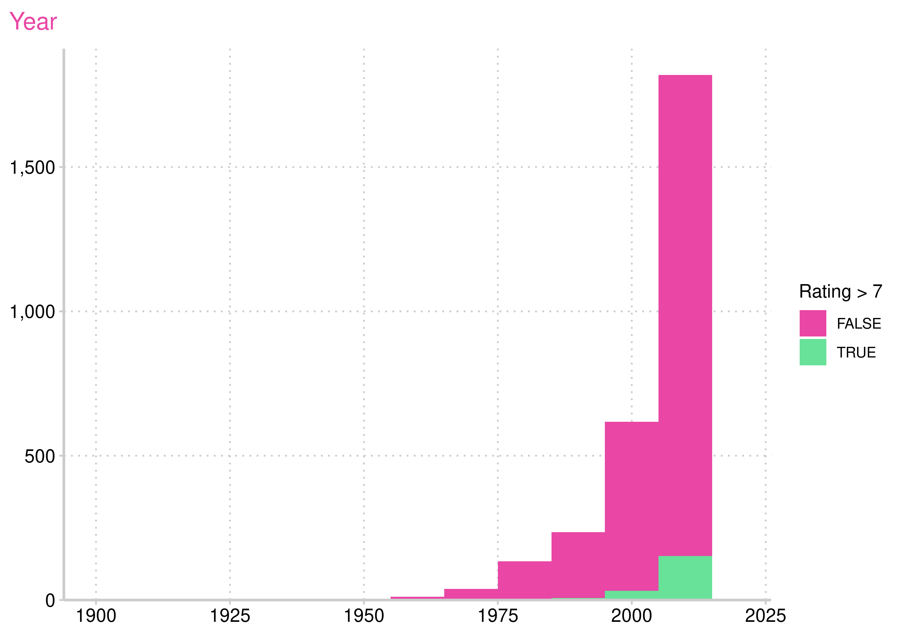

```r
ggplot(to_build, aes(year, fill = geek_rating >= 7)) +
  geom_histogram(binwidth = 10, position = 'fill')  +
  xlim(1900, 2020) +
  scale_y_pct() +
  labs(title = 'Year', x = NULL, y = NULL, fill = 'Rating > 7')
```

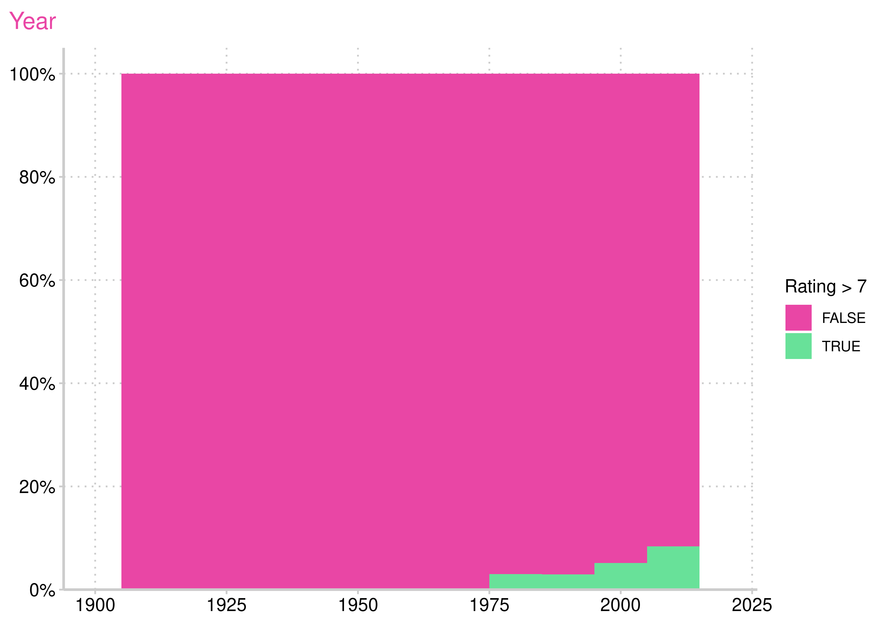

## Time

- if zero reset to missing and impute
- if > 240 then set to 240


```r
summary(to_build$avg_time)
```

```
   Min. 1st Qu.  Median    Mean 3rd Qu.    Max. 
    0.0    30.0    60.0   117.2   120.0 22500.0 
```

```r
ggplot(to_build, aes(avg_time, fill = geek_rating >= 7)) +
  geom_histogram(binwidth = 15) +
  xlim(0, 240) +
  scale_y_comma() +
  labs(title = 'Average Time', x = NULL, y = NULL, fill = 'Rating > 7')
```


```r
ggplot(to_build, aes(avg_time, fill = geek_rating >= 7)) +
  geom_histogram(binwidth = 15, position = 'fill') +
  xlim(0, 240) +
  scale_y_pct() +
  labs(title = 'Average Time', x = NULL, y = NULL, fill = 'Rating > 7')  
```

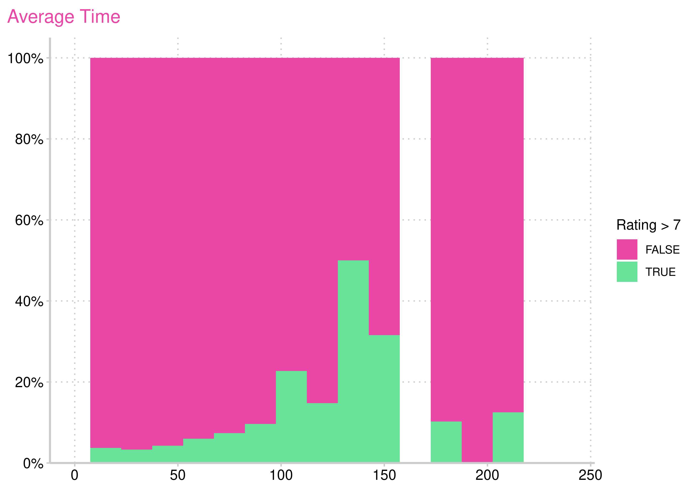

```r
summary(to_build$min_time)
```

```
   Min. 1st Qu.  Median    Mean 3rd Qu.    Max. 
   0.00   30.00   45.00   82.53   90.00 5400.00 
```

```r
ggplot(to_build, aes(min_time, fill = geek_rating >= 7)) +
  geom_histogram(binwidth = 15) +
  xlim(0, 240) +
  scale_y_comma() +
  labs(title = 'Min Time', x = NULL, y = NULL, fill = 'Rating > 7')
```

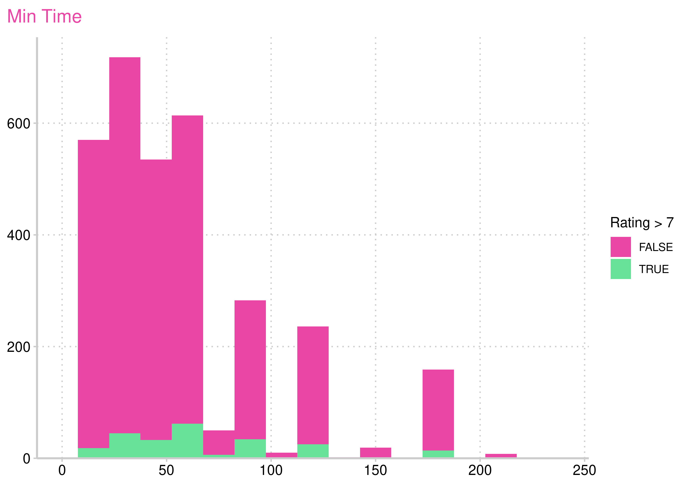

```r
ggplot(to_build, aes(min_time, fill = geek_rating >= 7)) +
  geom_histogram(binwidth = 15, position = 'fill') +
  xlim(0, 240) +
  scale_y_pct() +
  labs(title = 'Min Time', x = NULL, y = NULL, fill = 'Rating > 7')
```

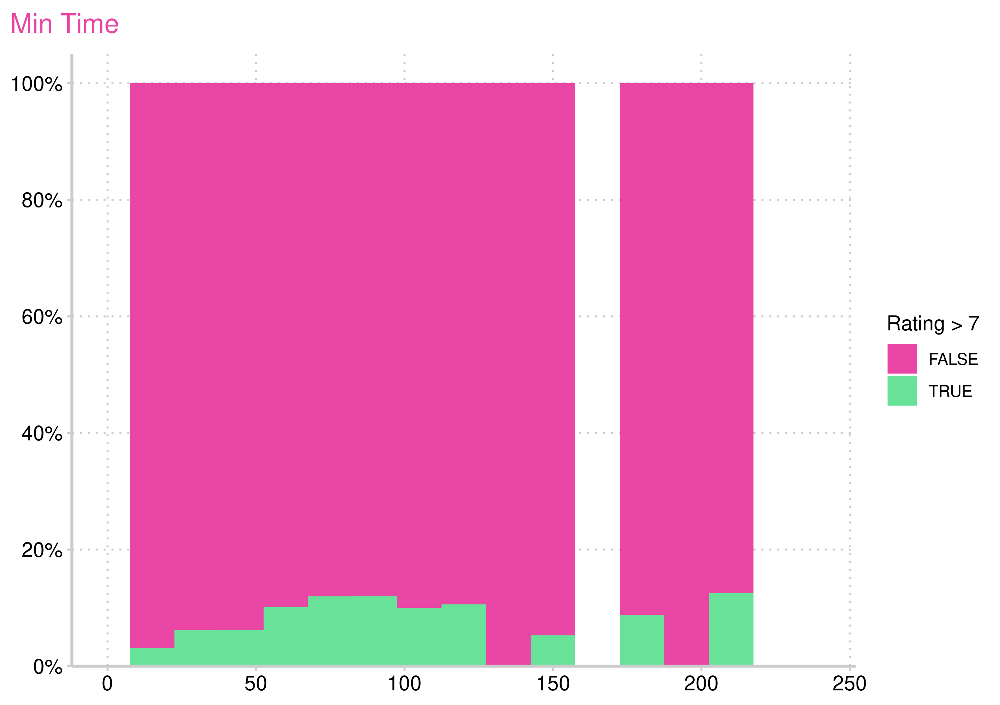

```r
summary(to_build$max_time)
```

```
   Min. 1st Qu.  Median    Mean 3rd Qu.    Max. 
    0.0    30.0    60.0   116.8   120.0 22500.0 
```

```r
ggplot(to_build, aes(max_time, fill = geek_rating >= 7)) +
  geom_histogram(binwidth = 15) +
  xlim(0, 240) +
  scale_y_comma() +
  labs(title = 'Max Time', x = NULL, y = NULL, fill = 'Rating > 7')
```

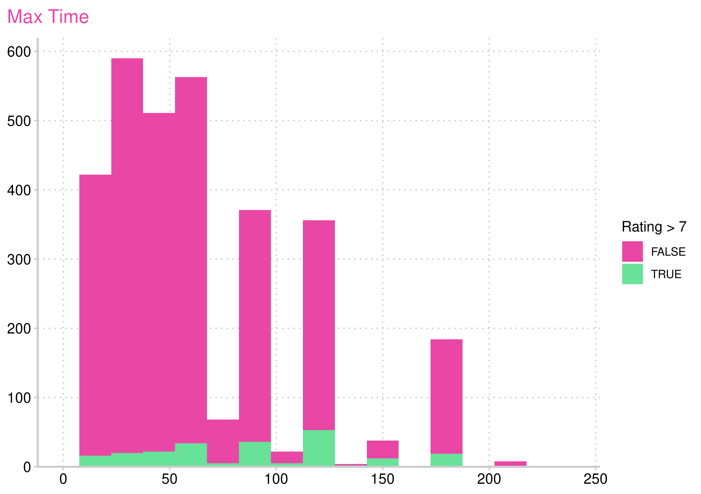

```r
ggplot(to_build, aes(max_time, fill = geek_rating >= 7)) +
  geom_histogram(binwidth = 15, position = 'fill') +
  xlim(0, 240) +
  scale_y_pct() +
  labs(title = 'Max Time', x = NULL, y = NULL, fill = 'Rating > 7')
```

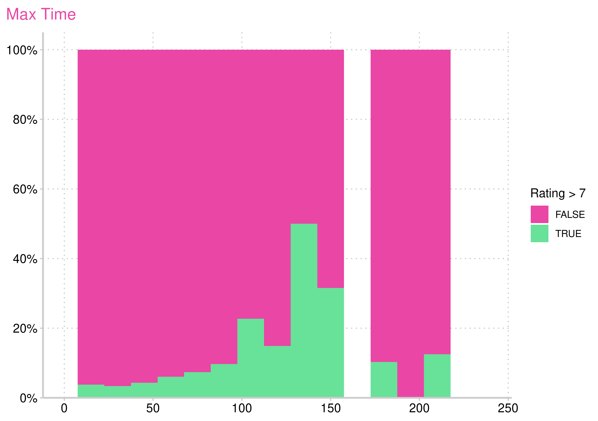


## Number of votes

- log transform


```r
summary(to_build$num_votes)
```

```
   Min. 1st Qu.  Median    Mean 3rd Qu.    Max. 
     62     281     618    2006    1640   77423 
```

```r
ggplot(to_build, aes(num_votes, fill = geek_rating >= 7)) +
  geom_histogram(bins = 50) +
  scale_x_log10(label = comma_format()) +
  scale_y_comma() +
  labs(title = 'Number of votes', x = NULL, y = NULL, fill = 'Rating > 7')
```

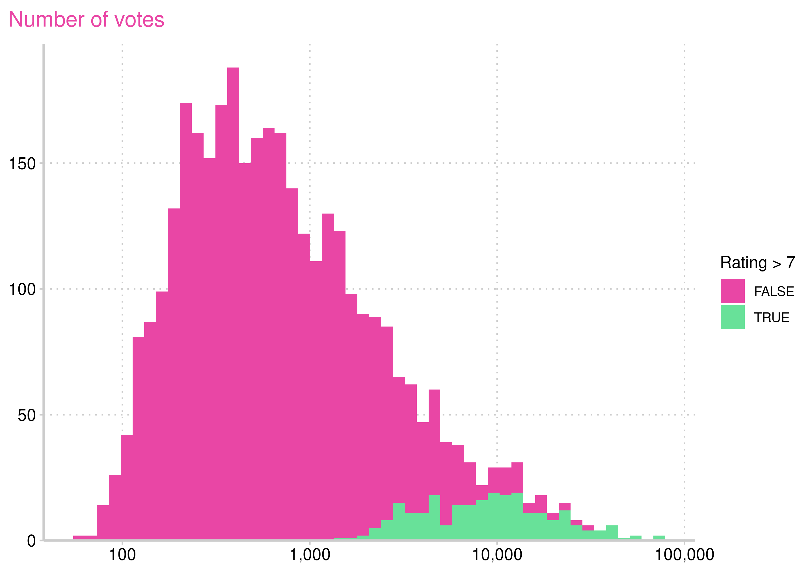

```r
ggplot(to_build, aes(num_votes, fill = geek_rating >= 7)) +
  geom_histogram(bins = 50, position = 'fill') +
  scale_x_log10(label = comma_format()) +
  scale_y_pct() +
  labs(title = 'Number of votes', x = NULL, y = NULL, fill = 'Rating > 7')
```

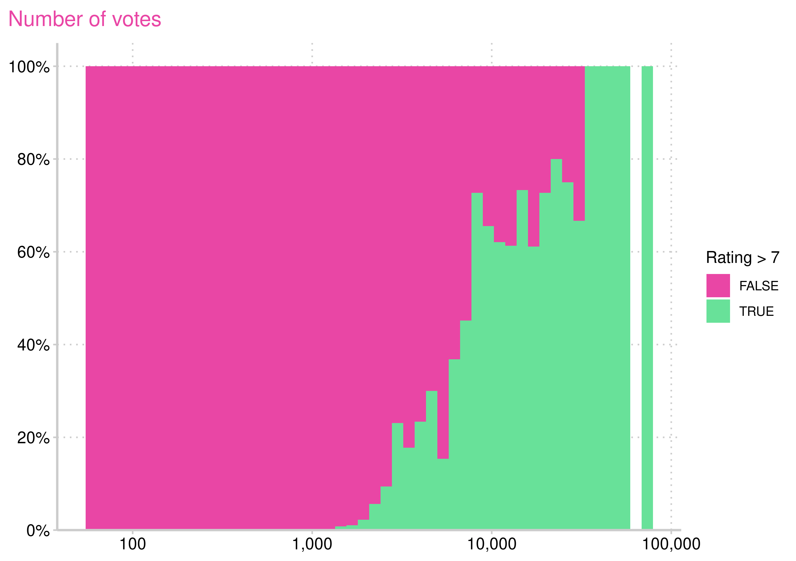

## Owned

- log transform


```r
summary(to_build$owned)
```

```
    Min.  1st Qu.   Median     Mean  3rd Qu.     Max. 
    49.0    622.5   1204.0   3055.0   2723.0 111807.0 
```

```r
ggplot(to_build, aes(owned, fill = geek_rating >= 7)) +
  geom_histogram(bins = 50) +
  scale_x_log10(label = comma_format()) +
  scale_y_comma() +
  labs(title = 'Owned', x = NULL, y = NULL, fill = 'Rating > 7')
```

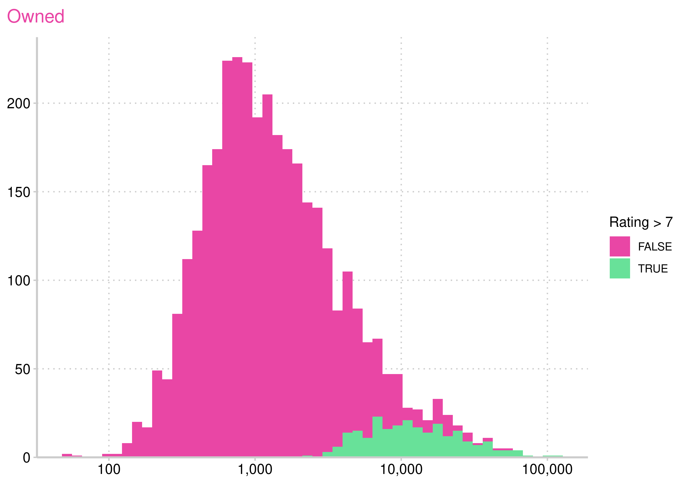

```r
ggplot(to_build, aes(owned, fill = geek_rating >= 7)) +
  geom_histogram(bins = 50, position = 'fill') +
  scale_x_log10(label = comma_format()) +
  scale_y_pct() +
  labs(title = 'Owned', x = NULL, y = NULL, fill = 'Rating > 7')
```

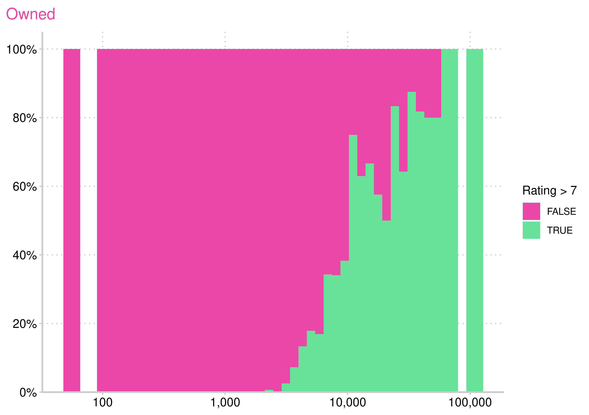


## Age

- looks okay


```r
summary(to_build$age)
```

```
   Min. 1st Qu.  Median    Mean 3rd Qu.    Max. 
   0.00    8.00   11.00   10.43   12.00   42.00 
```

```r
ggplot(to_build, aes(age, fill = geek_rating >= 7)) +
  geom_histogram(binwidth = 1) +
  xlim(0, 20) +
  scale_y_comma() +
  labs(title = 'Age', x = NULL, y = NULL, fill = 'Rating > 7')
```

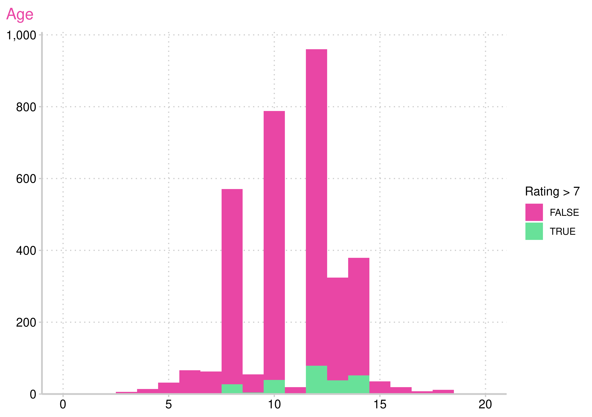

```r
ggplot(to_build, aes(age, fill = geek_rating >= 7)) +
  geom_histogram(binwidth = 1, position = 'fill')  +
  xlim(0, 20) +
  scale_y_pct() +
  labs(title = 'Age', x = NULL, y = NULL, fill = 'Rating > 7')
```

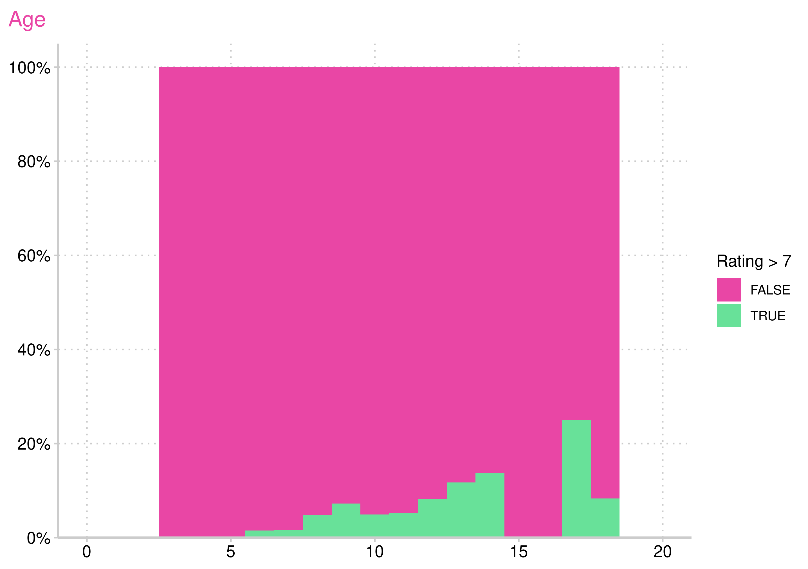

## Common categories

- flags where 5% +


```r
top_cat <- to_build %>%
  select(starts_with('cate')) %>%
  gather(key = 'key', value = 'value') %>%
  filter(! is.na(value)) %>%
  count(value, sort = TRUE) %>%
  #slice(1:20) %>%
  select(value, n) %>%
  mutate(pct = n /  nrow(to_build)) %>%
  filter(pct > 0.05)

ggplot(top_cat, aes(fct_reorder(value, n), pct)) +
  geom_col() +
  coord_flip() +
  scale_y_pct() +
  labs(title = 'Top categories', x = NULL, y = NULL, fill = 'Rating > 7')
```

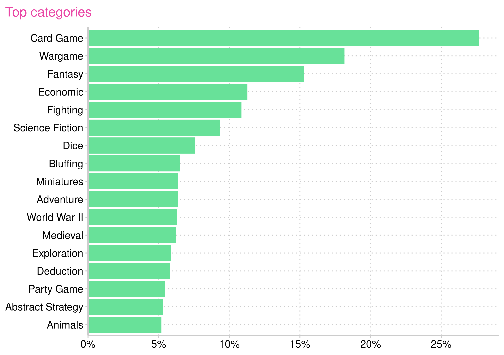

## Common mechanic

- flags where 5% +


```r
top_mechanic <- to_build %>%
  select(mechanic) %>%
  mutate(mechanic = str_split(mechanic, ',')) %>%
  unnest(mechanic) %>%
  mutate(mechanic = str_trim(mechanic)) %>%
  count(mechanic, sort = TRUE) %>%
  #slice(1:20) %>%
  select(mechanic, n) %>%
  mutate(pct = n /  nrow(to_build)) %>%
  filter(pct > 0.05)

ggplot(top_mechanic, aes(fct_reorder(mechanic, n), pct)) +
  geom_col() +
  coord_flip() +
  scale_y_pct() +
  labs(title = 'Top mechanics', x = NULL, y = NULL, fill = 'Rating > 7')
```

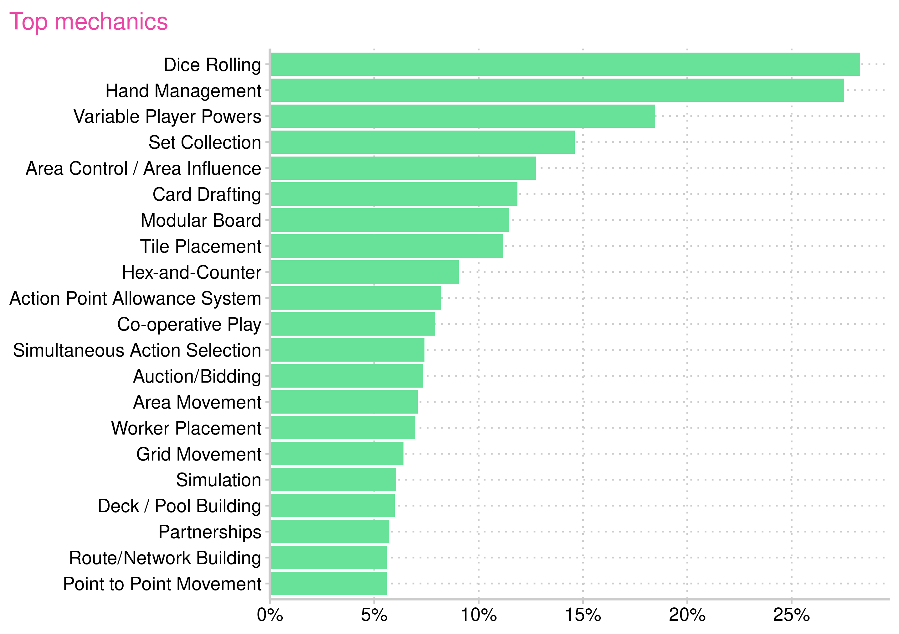

## Designer


```r
top_designer <- to_build %>%
  select(designer)%>%
  mutate(designer = str_split(designer, ',')) %>%
  unnest(designer) %>%
  mutate(designer = str_trim(designer)) %>%
  count(designer, sort = TRUE) %>%
  filter(! designer %in% c('(Uncredited)', 'Jr.')) %>%
  slice(1:10) %>%
  select(designer, n) %>%
  mutate(pct = n /  nrow(to_build))

ggplot(top_designer, aes(fct_reorder(designer, n), pct)) +
  geom_col() +
  coord_flip()  +
  scale_y_pct(accuracy = 0.1) +
  labs(title = 'Top designers', x = NULL, y = NULL, fill = 'Rating > 7')
```

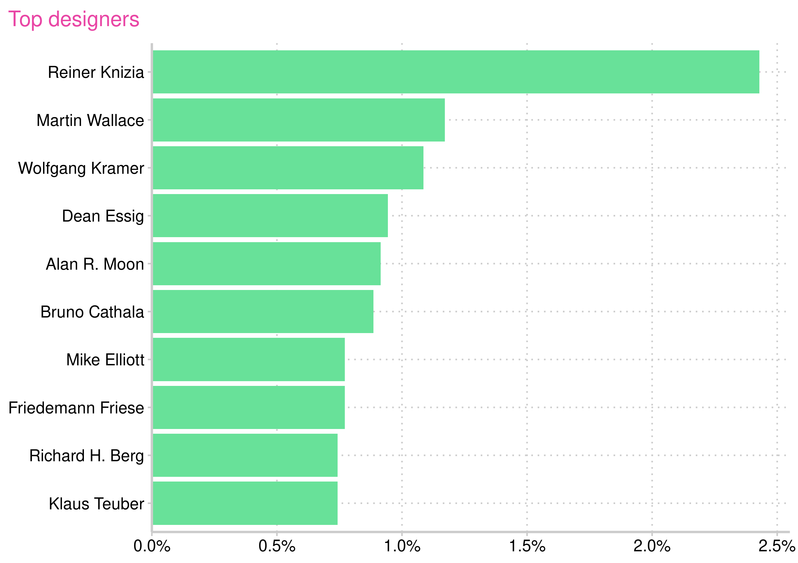

# Split in to train and test


```r
set.seed(539)

split <- initial_split(to_build, strata = geek_rating)
train <- training(split)
test <- testing(split)
```

# Create recipe


```r
rec <- recipe(geek_rating ~ ., data = train) %>%
  # id role for game_id
  update_role(game_id, new_role = "ID") %>%
  # flags for categories
  step_mutate(
    
    cat_card_game = if_any(starts_with("cate"), ~ .x == "Card Game"),
    cat_card_game =as.numeric( replace_na(cat_card_game, FALSE)),
    
    cat_wargame = if_any(starts_with("cate"), ~ .x == "Wargame"),
    cat_wargame = as.numeric(replace_na(cat_wargame, FALSE)),
    
    cat_fantasy = if_any(starts_with("cate"), ~ .x == "Fantasy"),
    cat_fantasy = as.numeric(replace_na(cat_fantasy, FALSE)),
    
    cat_economic = if_any(starts_with("cate"), ~ .x == "Economic"),
    cat_economic = as.numeric(replace_na(cat_economic, FALSE)),
    
    cat_fighting = if_any(starts_with("cate"), ~ .x == "Fighting"),
    cat_fighting = as.numeric(replace_na(cat_fighting, FALSE)),
    
    cat_science_fiction = if_any(starts_with("cate"), ~ .x == 
      "Science Fiction"),
    cat_science_fiction = as.numeric(replace_na(cat_science_fiction, FALSE)),
    
    cat_dice = if_any(starts_with("cate"), ~ .x == "Dice"),
    cat_dice = as.numeric(replace_na(cat_dice, FALSE)),
    
    cat_bluffing = if_any(starts_with("cate"), ~ .x == "Bluffing"),
    cat_bluffing = as.numeric(replace_na(cat_bluffing, FALSE)),
    
    cat_adventure = if_any(starts_with("cate"), ~ .x == "Adventure"),
    cat_adventure = as.numeric(replace_na(cat_adventure, FALSE)),
    
    cat_miniatures = if_any(starts_with("cate"), ~ .x == "Miniatures"),
    cat_miniatures = as.numeric(replace_na(cat_miniatures, FALSE)),
    
    cat_ww2 = if_any(starts_with("cate"), ~ .x == "World War II"),
    cat_ww2 = as.numeric(replace_na(cat_ww2, FALSE)),
    
    cat_medieval = if_any(starts_with("cate"), ~ .x == "Medieval"),
    cat_medieval = as.numeric(replace_na(cat_medieval, FALSE)),
    
    cat_explor = if_any(starts_with("cate"), ~ .x == "Exploration"),
    cat_explor = as.numeric(replace_na(cat_explor, FALSE)),
    
    cat_deduct = if_any(starts_with("cate"), ~ .x == "Deduction"),
    cat_deduct = as.numeric(replace_na(cat_deduct, FALSE)),
    
    cat_party = if_any(starts_with("cate"), ~ .x == "Party Game"),
    cat_party = as.numeric(replace_na(cat_party, FALSE)),
    
    cat_abstract = if_any(starts_with("cate"), ~ .x == "Abstract Strategy"),
    cat_abstract = as.numeric(replace_na(cat_abstract, FALSE)),
    
    cat_animals = if_any(starts_with("cate"), ~ .x == "Animals"),
    cat_animals = as.numeric(replace_na(cat_animals, FALSE))
  ) %>%
  # flags for mechanic
  step_mutate(
    mech_dice = as.numeric(str_detect(mechanic, "Dice Rolling")),
    mech_hand = as.numeric(str_detect(mechanic, "Hand Management" )),
    mech_powers = as.numeric(str_detect(mechanic, "Variable Player Powers")),
    mech_sets = as.numeric(str_detect(mechanic, "Set Collection")),
    mech_infl = as.numeric(str_detect(mechanic, 
      "Area Control / Area Influence")),
    mech_draft = as.numeric(str_detect(mechanic, "Card Drafting")),
    mech_modular = as.numeric(str_detect(mechanic, "Modular Board")),
    mech_tile = as.numeric(str_detect(mechanic, "Tile Placement")),
    mech_hex = as.numeric(str_detect(mechanic, "Hex-and-Counter")),
    mech_action = as.numeric(str_detect(mechanic, 
      "Action Point Allowance System")),
    mech_coop = as.numeric(str_detect(mechanic, "Co-operative Play")),
    mech_sas = as.numeric(str_detect(mechanic, 
      "Simultaneous Action Selection")),
    mech_auction = as.numeric(str_detect(mechanic, "Auction/Bidding")),
    mech_area = as.numeric(str_detect(mechanic, "Area Movement")),
    mech_worker = as.numeric(str_detect(mechanic, "Worker Placement")),
    mech_grid = as.numeric(str_detect(mechanic, "Grid Movement")),
    mech_simul = as.numeric(str_detect(mechanic, "Simulation")),
    mech_deck = as.numeric(str_detect(mechanic, "Deck / Pool Building")),
    mech_partner = as.numeric(str_detect(mechanic, "Partnerships")),
    mech_point = as.numeric(str_detect(mechanic, "Point to Point Movement")),
    mech_route = as.numeric(str_detect(mechanic, "Route/Network Building"))  
  ) %>%
  # flags for mechanic
  step_mutate(
    design_1 = as.numeric(str_detect(designer, "Reiner Knizia")),
    design_2 = as.numeric(str_detect(designer, "Martin Wallace")),
    design_3 = as.numeric(str_detect(designer, "Wolfgang Kramer")),
    design_4 = as.numeric(str_detect(designer, "Dean Essig")),
    design_5 = as.numeric(str_detect(designer, "Alan R. Moon")),
    design_6 = as.numeric(str_detect(designer, "Bruno Cathala")),
    design_7 = as.numeric(str_detect(designer, "Friedemann Friese")),
    design_8 = as.numeric(str_detect(designer, "Mike Elliott")),
    design_9 = as.numeric(str_detect(designer, "Klaus Teuber")),
    design_10 = as.numeric(str_detect(designer, "Richard H. Berg"))
  ) %>%
  # remove the name, designer, mechanic and category variables
  step_rm(names, mechanic, designer, category1:category12) %>%
  # log transformation
  step_log(num_votes, owned) %>%
  # outliers
  step_mutate(
    min_players = case_when(
      min_players == 0 ~ as.numeric(NA), 
      min_players > 20 ~ 20,
      TRUE ~ min_players
    ),
    max_players = case_when(
      max_players == 0 ~ as.numeric(NA), 
      max_players > 20 ~ 20,
      TRUE ~ max_players
    ),
    min_time = case_when(
      min_time == 0 ~ as.numeric(NA),
      min_time > 240 ~ 240,
      TRUE ~ min_time
    ),
    max_time = case_when(
      max_time == 0 ~ as.numeric(NA),
      max_time > 240 ~ 240,
      TRUE ~ max_time
    ),
    avg_time = case_when(
      avg_time == 0 ~ as.numeric(NA),
      avg_time > 240 ~ 240,
      TRUE ~ avg_time
    ),
    year = case_when(
        year == 0 ~ as.numeric(NA), 
        year < 1900 ~ 1900,
        TRUE ~ year
    )
  ) %>%
  # imputation
  step_impute_mean(min_players, max_players, year, min_time, max_time, avg_time)
```

# Check recipe outputs


```r
prepped <- prep(rec)
baked <- bake(prepped, new_data = NULL) 

skim(baked)  
```


<table style='width: auto;'
        class='table table-condensed'>
<caption>Data summary</caption>
 <thead>
  <tr>
   <th style="text-align:left;">   </th>
   <th style="text-align:left;">   </th>
  </tr>
 </thead>
<tbody>
  <tr>
   <td style="text-align:left;"> Name </td>
   <td style="text-align:left;"> baked </td>
  </tr>
  <tr>
   <td style="text-align:left;"> Number of rows </td>
   <td style="text-align:left;"> 2623 </td>
  </tr>
  <tr>
   <td style="text-align:left;"> Number of columns </td>
   <td style="text-align:left;"> 59 </td>
  </tr>
  <tr>
   <td style="text-align:left;"> _______________________ </td>
   <td style="text-align:left;">  </td>
  </tr>
  <tr>
   <td style="text-align:left;"> Column type frequency: </td>
   <td style="text-align:left;">  </td>
  </tr>
  <tr>
   <td style="text-align:left;"> numeric </td>
   <td style="text-align:left;"> 59 </td>
  </tr>
  <tr>
   <td style="text-align:left;"> ________________________ </td>
   <td style="text-align:left;">  </td>
  </tr>
  <tr>
   <td style="text-align:left;"> Group variables </td>
   <td style="text-align:left;"> None </td>
  </tr>
</tbody>
</table>


**Variable type: numeric**

<table>
 <thead>
  <tr>
   <th style="text-align:left;"> skim_variable </th>
   <th style="text-align:right;"> n_missing </th>
   <th style="text-align:right;"> complete_rate </th>
   <th style="text-align:right;"> mean </th>
   <th style="text-align:right;"> sd </th>
   <th style="text-align:right;"> p0 </th>
   <th style="text-align:right;"> p25 </th>
   <th style="text-align:right;"> p50 </th>
   <th style="text-align:right;"> p75 </th>
   <th style="text-align:right;"> p100 </th>
   <th style="text-align:left;"> hist </th>
  </tr>
 </thead>
<tbody>
  <tr>
   <td style="text-align:left;"> game_id </td>
   <td style="text-align:right;"> 0 </td>
   <td style="text-align:right;"> 1 </td>
   <td style="text-align:right;"> 88298.34 </td>
   <td style="text-align:right;"> 76614.03 </td>
   <td style="text-align:right;"> 2.00 </td>
   <td style="text-align:right;"> 10906.00 </td>
   <td style="text-align:right;"> 69601.00 </td>
   <td style="text-align:right;"> 159125.00 </td>
   <td style="text-align:right;"> 244522.00 </td>
   <td style="text-align:left;"> ▇▂▂▃▂ </td>
  </tr>
  <tr>
   <td style="text-align:left;"> min_players </td>
   <td style="text-align:right;"> 0 </td>
   <td style="text-align:right;"> 1 </td>
   <td style="text-align:right;"> 2.02 </td>
   <td style="text-align:right;"> 0.65 </td>
   <td style="text-align:right;"> 1.00 </td>
   <td style="text-align:right;"> 2.00 </td>
   <td style="text-align:right;"> 2.00 </td>
   <td style="text-align:right;"> 2.00 </td>
   <td style="text-align:right;"> 8.00 </td>
   <td style="text-align:left;"> ▇▁▁▁▁ </td>
  </tr>
  <tr>
   <td style="text-align:left;"> max_players </td>
   <td style="text-align:right;"> 0 </td>
   <td style="text-align:right;"> 1 </td>
   <td style="text-align:right;"> 4.70 </td>
   <td style="text-align:right;"> 2.51 </td>
   <td style="text-align:right;"> 1.00 </td>
   <td style="text-align:right;"> 4.00 </td>
   <td style="text-align:right;"> 4.00 </td>
   <td style="text-align:right;"> 6.00 </td>
   <td style="text-align:right;"> 20.00 </td>
   <td style="text-align:left;"> ▇▆▁▁▁ </td>
  </tr>
  <tr>
   <td style="text-align:left;"> avg_time </td>
   <td style="text-align:right;"> 0 </td>
   <td style="text-align:right;"> 1 </td>
   <td style="text-align:right;"> 80.37 </td>
   <td style="text-align:right;"> 65.29 </td>
   <td style="text-align:right;"> 5.00 </td>
   <td style="text-align:right;"> 30.00 </td>
   <td style="text-align:right;"> 60.00 </td>
   <td style="text-align:right;"> 120.00 </td>
   <td style="text-align:right;"> 240.00 </td>
   <td style="text-align:left;"> ▇▅▂▁▂ </td>
  </tr>
  <tr>
   <td style="text-align:left;"> min_time </td>
   <td style="text-align:right;"> 0 </td>
   <td style="text-align:right;"> 1 </td>
   <td style="text-align:right;"> 67.91 </td>
   <td style="text-align:right;"> 59.52 </td>
   <td style="text-align:right;"> 1.00 </td>
   <td style="text-align:right;"> 30.00 </td>
   <td style="text-align:right;"> 45.00 </td>
   <td style="text-align:right;"> 90.00 </td>
   <td style="text-align:right;"> 240.00 </td>
   <td style="text-align:left;"> ▇▅▁▁▁ </td>
  </tr>
  <tr>
   <td style="text-align:left;"> max_time </td>
   <td style="text-align:right;"> 0 </td>
   <td style="text-align:right;"> 1 </td>
   <td style="text-align:right;"> 80.67 </td>
   <td style="text-align:right;"> 65.14 </td>
   <td style="text-align:right;"> 5.00 </td>
   <td style="text-align:right;"> 30.00 </td>
   <td style="text-align:right;"> 60.00 </td>
   <td style="text-align:right;"> 120.00 </td>
   <td style="text-align:right;"> 240.00 </td>
   <td style="text-align:left;"> ▇▆▂▁▂ </td>
  </tr>
  <tr>
   <td style="text-align:left;"> year </td>
   <td style="text-align:right;"> 0 </td>
   <td style="text-align:right;"> 1 </td>
   <td style="text-align:right;"> 2006.41 </td>
   <td style="text-align:right;"> 13.77 </td>
   <td style="text-align:right;"> 1900.00 </td>
   <td style="text-align:right;"> 2003.00 </td>
   <td style="text-align:right;"> 2010.00 </td>
   <td style="text-align:right;"> 2015.00 </td>
   <td style="text-align:right;"> 2018.00 </td>
   <td style="text-align:left;"> ▁▁▁▁▇ </td>
  </tr>
  <tr>
   <td style="text-align:left;"> num_votes </td>
   <td style="text-align:right;"> 0 </td>
   <td style="text-align:right;"> 1 </td>
   <td style="text-align:right;"> 6.62 </td>
   <td style="text-align:right;"> 1.27 </td>
   <td style="text-align:right;"> 4.14 </td>
   <td style="text-align:right;"> 5.63 </td>
   <td style="text-align:right;"> 6.43 </td>
   <td style="text-align:right;"> 7.40 </td>
   <td style="text-align:right;"> 11.26 </td>
   <td style="text-align:left;"> ▅▇▅▂▁ </td>
  </tr>
  <tr>
   <td style="text-align:left;"> age </td>
   <td style="text-align:right;"> 0 </td>
   <td style="text-align:right;"> 1 </td>
   <td style="text-align:right;"> 10.46 </td>
   <td style="text-align:right;"> 3.20 </td>
   <td style="text-align:right;"> 0.00 </td>
   <td style="text-align:right;"> 8.00 </td>
   <td style="text-align:right;"> 12.00 </td>
   <td style="text-align:right;"> 12.00 </td>
   <td style="text-align:right;"> 42.00 </td>
   <td style="text-align:left;"> ▃▇▁▁▁ </td>
  </tr>
  <tr>
   <td style="text-align:left;"> owned </td>
   <td style="text-align:right;"> 0 </td>
   <td style="text-align:right;"> 1 </td>
   <td style="text-align:right;"> 7.24 </td>
   <td style="text-align:right;"> 1.13 </td>
   <td style="text-align:right;"> 3.89 </td>
   <td style="text-align:right;"> 6.42 </td>
   <td style="text-align:right;"> 7.09 </td>
   <td style="text-align:right;"> 7.92 </td>
   <td style="text-align:right;"> 11.62 </td>
   <td style="text-align:left;"> ▁▇▇▂▁ </td>
  </tr>
  <tr>
   <td style="text-align:left;"> geek_rating </td>
   <td style="text-align:right;"> 0 </td>
   <td style="text-align:right;"> 1 </td>
   <td style="text-align:right;"> 6.09 </td>
   <td style="text-align:right;"> 0.49 </td>
   <td style="text-align:right;"> 5.64 </td>
   <td style="text-align:right;"> 5.73 </td>
   <td style="text-align:right;"> 5.90 </td>
   <td style="text-align:right;"> 6.30 </td>
   <td style="text-align:right;"> 8.50 </td>
   <td style="text-align:left;"> ▇▂▁▁▁ </td>
  </tr>
  <tr>
   <td style="text-align:left;"> cat_card_game </td>
   <td style="text-align:right;"> 0 </td>
   <td style="text-align:right;"> 1 </td>
   <td style="text-align:right;"> 0.28 </td>
   <td style="text-align:right;"> 0.45 </td>
   <td style="text-align:right;"> 0.00 </td>
   <td style="text-align:right;"> 0.00 </td>
   <td style="text-align:right;"> 0.00 </td>
   <td style="text-align:right;"> 1.00 </td>
   <td style="text-align:right;"> 1.00 </td>
   <td style="text-align:left;"> ▇▁▁▁▃ </td>
  </tr>
  <tr>
   <td style="text-align:left;"> cat_wargame </td>
   <td style="text-align:right;"> 0 </td>
   <td style="text-align:right;"> 1 </td>
   <td style="text-align:right;"> 0.18 </td>
   <td style="text-align:right;"> 0.38 </td>
   <td style="text-align:right;"> 0.00 </td>
   <td style="text-align:right;"> 0.00 </td>
   <td style="text-align:right;"> 0.00 </td>
   <td style="text-align:right;"> 0.00 </td>
   <td style="text-align:right;"> 1.00 </td>
   <td style="text-align:left;"> ▇▁▁▁▂ </td>
  </tr>
  <tr>
   <td style="text-align:left;"> cat_fantasy </td>
   <td style="text-align:right;"> 0 </td>
   <td style="text-align:right;"> 1 </td>
   <td style="text-align:right;"> 0.15 </td>
   <td style="text-align:right;"> 0.36 </td>
   <td style="text-align:right;"> 0.00 </td>
   <td style="text-align:right;"> 0.00 </td>
   <td style="text-align:right;"> 0.00 </td>
   <td style="text-align:right;"> 0.00 </td>
   <td style="text-align:right;"> 1.00 </td>
   <td style="text-align:left;"> ▇▁▁▁▂ </td>
  </tr>
  <tr>
   <td style="text-align:left;"> cat_economic </td>
   <td style="text-align:right;"> 0 </td>
   <td style="text-align:right;"> 1 </td>
   <td style="text-align:right;"> 0.11 </td>
   <td style="text-align:right;"> 0.32 </td>
   <td style="text-align:right;"> 0.00 </td>
   <td style="text-align:right;"> 0.00 </td>
   <td style="text-align:right;"> 0.00 </td>
   <td style="text-align:right;"> 0.00 </td>
   <td style="text-align:right;"> 1.00 </td>
   <td style="text-align:left;"> ▇▁▁▁▁ </td>
  </tr>
  <tr>
   <td style="text-align:left;"> cat_fighting </td>
   <td style="text-align:right;"> 0 </td>
   <td style="text-align:right;"> 1 </td>
   <td style="text-align:right;"> 0.11 </td>
   <td style="text-align:right;"> 0.31 </td>
   <td style="text-align:right;"> 0.00 </td>
   <td style="text-align:right;"> 0.00 </td>
   <td style="text-align:right;"> 0.00 </td>
   <td style="text-align:right;"> 0.00 </td>
   <td style="text-align:right;"> 1.00 </td>
   <td style="text-align:left;"> ▇▁▁▁▁ </td>
  </tr>
  <tr>
   <td style="text-align:left;"> cat_science_fiction </td>
   <td style="text-align:right;"> 0 </td>
   <td style="text-align:right;"> 1 </td>
   <td style="text-align:right;"> 0.09 </td>
   <td style="text-align:right;"> 0.28 </td>
   <td style="text-align:right;"> 0.00 </td>
   <td style="text-align:right;"> 0.00 </td>
   <td style="text-align:right;"> 0.00 </td>
   <td style="text-align:right;"> 0.00 </td>
   <td style="text-align:right;"> 1.00 </td>
   <td style="text-align:left;"> ▇▁▁▁▁ </td>
  </tr>
  <tr>
   <td style="text-align:left;"> cat_dice </td>
   <td style="text-align:right;"> 0 </td>
   <td style="text-align:right;"> 1 </td>
   <td style="text-align:right;"> 0.08 </td>
   <td style="text-align:right;"> 0.27 </td>
   <td style="text-align:right;"> 0.00 </td>
   <td style="text-align:right;"> 0.00 </td>
   <td style="text-align:right;"> 0.00 </td>
   <td style="text-align:right;"> 0.00 </td>
   <td style="text-align:right;"> 1.00 </td>
   <td style="text-align:left;"> ▇▁▁▁▁ </td>
  </tr>
  <tr>
   <td style="text-align:left;"> cat_bluffing </td>
   <td style="text-align:right;"> 0 </td>
   <td style="text-align:right;"> 1 </td>
   <td style="text-align:right;"> 0.06 </td>
   <td style="text-align:right;"> 0.25 </td>
   <td style="text-align:right;"> 0.00 </td>
   <td style="text-align:right;"> 0.00 </td>
   <td style="text-align:right;"> 0.00 </td>
   <td style="text-align:right;"> 0.00 </td>
   <td style="text-align:right;"> 1.00 </td>
   <td style="text-align:left;"> ▇▁▁▁▁ </td>
  </tr>
  <tr>
   <td style="text-align:left;"> cat_adventure </td>
   <td style="text-align:right;"> 0 </td>
   <td style="text-align:right;"> 1 </td>
   <td style="text-align:right;"> 0.06 </td>
   <td style="text-align:right;"> 0.24 </td>
   <td style="text-align:right;"> 0.00 </td>
   <td style="text-align:right;"> 0.00 </td>
   <td style="text-align:right;"> 0.00 </td>
   <td style="text-align:right;"> 0.00 </td>
   <td style="text-align:right;"> 1.00 </td>
   <td style="text-align:left;"> ▇▁▁▁▁ </td>
  </tr>
  <tr>
   <td style="text-align:left;"> cat_miniatures </td>
   <td style="text-align:right;"> 0 </td>
   <td style="text-align:right;"> 1 </td>
   <td style="text-align:right;"> 0.06 </td>
   <td style="text-align:right;"> 0.24 </td>
   <td style="text-align:right;"> 0.00 </td>
   <td style="text-align:right;"> 0.00 </td>
   <td style="text-align:right;"> 0.00 </td>
   <td style="text-align:right;"> 0.00 </td>
   <td style="text-align:right;"> 1.00 </td>
   <td style="text-align:left;"> ▇▁▁▁▁ </td>
  </tr>
  <tr>
   <td style="text-align:left;"> cat_ww2 </td>
   <td style="text-align:right;"> 0 </td>
   <td style="text-align:right;"> 1 </td>
   <td style="text-align:right;"> 0.06 </td>
   <td style="text-align:right;"> 0.24 </td>
   <td style="text-align:right;"> 0.00 </td>
   <td style="text-align:right;"> 0.00 </td>
   <td style="text-align:right;"> 0.00 </td>
   <td style="text-align:right;"> 0.00 </td>
   <td style="text-align:right;"> 1.00 </td>
   <td style="text-align:left;"> ▇▁▁▁▁ </td>
  </tr>
  <tr>
   <td style="text-align:left;"> cat_medieval </td>
   <td style="text-align:right;"> 0 </td>
   <td style="text-align:right;"> 1 </td>
   <td style="text-align:right;"> 0.06 </td>
   <td style="text-align:right;"> 0.24 </td>
   <td style="text-align:right;"> 0.00 </td>
   <td style="text-align:right;"> 0.00 </td>
   <td style="text-align:right;"> 0.00 </td>
   <td style="text-align:right;"> 0.00 </td>
   <td style="text-align:right;"> 1.00 </td>
   <td style="text-align:left;"> ▇▁▁▁▁ </td>
  </tr>
  <tr>
   <td style="text-align:left;"> cat_explor </td>
   <td style="text-align:right;"> 0 </td>
   <td style="text-align:right;"> 1 </td>
   <td style="text-align:right;"> 0.06 </td>
   <td style="text-align:right;"> 0.23 </td>
   <td style="text-align:right;"> 0.00 </td>
   <td style="text-align:right;"> 0.00 </td>
   <td style="text-align:right;"> 0.00 </td>
   <td style="text-align:right;"> 0.00 </td>
   <td style="text-align:right;"> 1.00 </td>
   <td style="text-align:left;"> ▇▁▁▁▁ </td>
  </tr>
  <tr>
   <td style="text-align:left;"> cat_deduct </td>
   <td style="text-align:right;"> 0 </td>
   <td style="text-align:right;"> 1 </td>
   <td style="text-align:right;"> 0.06 </td>
   <td style="text-align:right;"> 0.24 </td>
   <td style="text-align:right;"> 0.00 </td>
   <td style="text-align:right;"> 0.00 </td>
   <td style="text-align:right;"> 0.00 </td>
   <td style="text-align:right;"> 0.00 </td>
   <td style="text-align:right;"> 1.00 </td>
   <td style="text-align:left;"> ▇▁▁▁▁ </td>
  </tr>
  <tr>
   <td style="text-align:left;"> cat_party </td>
   <td style="text-align:right;"> 0 </td>
   <td style="text-align:right;"> 1 </td>
   <td style="text-align:right;"> 0.05 </td>
   <td style="text-align:right;"> 0.23 </td>
   <td style="text-align:right;"> 0.00 </td>
   <td style="text-align:right;"> 0.00 </td>
   <td style="text-align:right;"> 0.00 </td>
   <td style="text-align:right;"> 0.00 </td>
   <td style="text-align:right;"> 1.00 </td>
   <td style="text-align:left;"> ▇▁▁▁▁ </td>
  </tr>
  <tr>
   <td style="text-align:left;"> cat_abstract </td>
   <td style="text-align:right;"> 0 </td>
   <td style="text-align:right;"> 1 </td>
   <td style="text-align:right;"> 0.05 </td>
   <td style="text-align:right;"> 0.23 </td>
   <td style="text-align:right;"> 0.00 </td>
   <td style="text-align:right;"> 0.00 </td>
   <td style="text-align:right;"> 0.00 </td>
   <td style="text-align:right;"> 0.00 </td>
   <td style="text-align:right;"> 1.00 </td>
   <td style="text-align:left;"> ▇▁▁▁▁ </td>
  </tr>
  <tr>
   <td style="text-align:left;"> cat_animals </td>
   <td style="text-align:right;"> 0 </td>
   <td style="text-align:right;"> 1 </td>
   <td style="text-align:right;"> 0.06 </td>
   <td style="text-align:right;"> 0.23 </td>
   <td style="text-align:right;"> 0.00 </td>
   <td style="text-align:right;"> 0.00 </td>
   <td style="text-align:right;"> 0.00 </td>
   <td style="text-align:right;"> 0.00 </td>
   <td style="text-align:right;"> 1.00 </td>
   <td style="text-align:left;"> ▇▁▁▁▁ </td>
  </tr>
  <tr>
   <td style="text-align:left;"> mech_dice </td>
   <td style="text-align:right;"> 0 </td>
   <td style="text-align:right;"> 1 </td>
   <td style="text-align:right;"> 0.28 </td>
   <td style="text-align:right;"> 0.45 </td>
   <td style="text-align:right;"> 0.00 </td>
   <td style="text-align:right;"> 0.00 </td>
   <td style="text-align:right;"> 0.00 </td>
   <td style="text-align:right;"> 1.00 </td>
   <td style="text-align:right;"> 1.00 </td>
   <td style="text-align:left;"> ▇▁▁▁▃ </td>
  </tr>
  <tr>
   <td style="text-align:left;"> mech_hand </td>
   <td style="text-align:right;"> 0 </td>
   <td style="text-align:right;"> 1 </td>
   <td style="text-align:right;"> 0.27 </td>
   <td style="text-align:right;"> 0.44 </td>
   <td style="text-align:right;"> 0.00 </td>
   <td style="text-align:right;"> 0.00 </td>
   <td style="text-align:right;"> 0.00 </td>
   <td style="text-align:right;"> 1.00 </td>
   <td style="text-align:right;"> 1.00 </td>
   <td style="text-align:left;"> ▇▁▁▁▃ </td>
  </tr>
  <tr>
   <td style="text-align:left;"> mech_powers </td>
   <td style="text-align:right;"> 0 </td>
   <td style="text-align:right;"> 1 </td>
   <td style="text-align:right;"> 0.18 </td>
   <td style="text-align:right;"> 0.39 </td>
   <td style="text-align:right;"> 0.00 </td>
   <td style="text-align:right;"> 0.00 </td>
   <td style="text-align:right;"> 0.00 </td>
   <td style="text-align:right;"> 0.00 </td>
   <td style="text-align:right;"> 1.00 </td>
   <td style="text-align:left;"> ▇▁▁▁▂ </td>
  </tr>
  <tr>
   <td style="text-align:left;"> mech_sets </td>
   <td style="text-align:right;"> 0 </td>
   <td style="text-align:right;"> 1 </td>
   <td style="text-align:right;"> 0.15 </td>
   <td style="text-align:right;"> 0.35 </td>
   <td style="text-align:right;"> 0.00 </td>
   <td style="text-align:right;"> 0.00 </td>
   <td style="text-align:right;"> 0.00 </td>
   <td style="text-align:right;"> 0.00 </td>
   <td style="text-align:right;"> 1.00 </td>
   <td style="text-align:left;"> ▇▁▁▁▂ </td>
  </tr>
  <tr>
   <td style="text-align:left;"> mech_infl </td>
   <td style="text-align:right;"> 0 </td>
   <td style="text-align:right;"> 1 </td>
   <td style="text-align:right;"> 0.13 </td>
   <td style="text-align:right;"> 0.33 </td>
   <td style="text-align:right;"> 0.00 </td>
   <td style="text-align:right;"> 0.00 </td>
   <td style="text-align:right;"> 0.00 </td>
   <td style="text-align:right;"> 0.00 </td>
   <td style="text-align:right;"> 1.00 </td>
   <td style="text-align:left;"> ▇▁▁▁▁ </td>
  </tr>
  <tr>
   <td style="text-align:left;"> mech_draft </td>
   <td style="text-align:right;"> 0 </td>
   <td style="text-align:right;"> 1 </td>
   <td style="text-align:right;"> 0.12 </td>
   <td style="text-align:right;"> 0.32 </td>
   <td style="text-align:right;"> 0.00 </td>
   <td style="text-align:right;"> 0.00 </td>
   <td style="text-align:right;"> 0.00 </td>
   <td style="text-align:right;"> 0.00 </td>
   <td style="text-align:right;"> 1.00 </td>
   <td style="text-align:left;"> ▇▁▁▁▁ </td>
  </tr>
  <tr>
   <td style="text-align:left;"> mech_modular </td>
   <td style="text-align:right;"> 0 </td>
   <td style="text-align:right;"> 1 </td>
   <td style="text-align:right;"> 0.12 </td>
   <td style="text-align:right;"> 0.32 </td>
   <td style="text-align:right;"> 0.00 </td>
   <td style="text-align:right;"> 0.00 </td>
   <td style="text-align:right;"> 0.00 </td>
   <td style="text-align:right;"> 0.00 </td>
   <td style="text-align:right;"> 1.00 </td>
   <td style="text-align:left;"> ▇▁▁▁▁ </td>
  </tr>
  <tr>
   <td style="text-align:left;"> mech_tile </td>
   <td style="text-align:right;"> 0 </td>
   <td style="text-align:right;"> 1 </td>
   <td style="text-align:right;"> 0.11 </td>
   <td style="text-align:right;"> 0.31 </td>
   <td style="text-align:right;"> 0.00 </td>
   <td style="text-align:right;"> 0.00 </td>
   <td style="text-align:right;"> 0.00 </td>
   <td style="text-align:right;"> 0.00 </td>
   <td style="text-align:right;"> 1.00 </td>
   <td style="text-align:left;"> ▇▁▁▁▁ </td>
  </tr>
  <tr>
   <td style="text-align:left;"> mech_hex </td>
   <td style="text-align:right;"> 0 </td>
   <td style="text-align:right;"> 1 </td>
   <td style="text-align:right;"> 0.09 </td>
   <td style="text-align:right;"> 0.28 </td>
   <td style="text-align:right;"> 0.00 </td>
   <td style="text-align:right;"> 0.00 </td>
   <td style="text-align:right;"> 0.00 </td>
   <td style="text-align:right;"> 0.00 </td>
   <td style="text-align:right;"> 1.00 </td>
   <td style="text-align:left;"> ▇▁▁▁▁ </td>
  </tr>
  <tr>
   <td style="text-align:left;"> mech_action </td>
   <td style="text-align:right;"> 0 </td>
   <td style="text-align:right;"> 1 </td>
   <td style="text-align:right;"> 0.08 </td>
   <td style="text-align:right;"> 0.27 </td>
   <td style="text-align:right;"> 0.00 </td>
   <td style="text-align:right;"> 0.00 </td>
   <td style="text-align:right;"> 0.00 </td>
   <td style="text-align:right;"> 0.00 </td>
   <td style="text-align:right;"> 1.00 </td>
   <td style="text-align:left;"> ▇▁▁▁▁ </td>
  </tr>
  <tr>
   <td style="text-align:left;"> mech_coop </td>
   <td style="text-align:right;"> 0 </td>
   <td style="text-align:right;"> 1 </td>
   <td style="text-align:right;"> 0.08 </td>
   <td style="text-align:right;"> 0.26 </td>
   <td style="text-align:right;"> 0.00 </td>
   <td style="text-align:right;"> 0.00 </td>
   <td style="text-align:right;"> 0.00 </td>
   <td style="text-align:right;"> 0.00 </td>
   <td style="text-align:right;"> 1.00 </td>
   <td style="text-align:left;"> ▇▁▁▁▁ </td>
  </tr>
  <tr>
   <td style="text-align:left;"> mech_sas </td>
   <td style="text-align:right;"> 0 </td>
   <td style="text-align:right;"> 1 </td>
   <td style="text-align:right;"> 0.08 </td>
   <td style="text-align:right;"> 0.27 </td>
   <td style="text-align:right;"> 0.00 </td>
   <td style="text-align:right;"> 0.00 </td>
   <td style="text-align:right;"> 0.00 </td>
   <td style="text-align:right;"> 0.00 </td>
   <td style="text-align:right;"> 1.00 </td>
   <td style="text-align:left;"> ▇▁▁▁▁ </td>
  </tr>
  <tr>
   <td style="text-align:left;"> mech_auction </td>
   <td style="text-align:right;"> 0 </td>
   <td style="text-align:right;"> 1 </td>
   <td style="text-align:right;"> 0.08 </td>
   <td style="text-align:right;"> 0.26 </td>
   <td style="text-align:right;"> 0.00 </td>
   <td style="text-align:right;"> 0.00 </td>
   <td style="text-align:right;"> 0.00 </td>
   <td style="text-align:right;"> 0.00 </td>
   <td style="text-align:right;"> 1.00 </td>
   <td style="text-align:left;"> ▇▁▁▁▁ </td>
  </tr>
  <tr>
   <td style="text-align:left;"> mech_area </td>
   <td style="text-align:right;"> 0 </td>
   <td style="text-align:right;"> 1 </td>
   <td style="text-align:right;"> 0.07 </td>
   <td style="text-align:right;"> 0.26 </td>
   <td style="text-align:right;"> 0.00 </td>
   <td style="text-align:right;"> 0.00 </td>
   <td style="text-align:right;"> 0.00 </td>
   <td style="text-align:right;"> 0.00 </td>
   <td style="text-align:right;"> 1.00 </td>
   <td style="text-align:left;"> ▇▁▁▁▁ </td>
  </tr>
  <tr>
   <td style="text-align:left;"> mech_worker </td>
   <td style="text-align:right;"> 0 </td>
   <td style="text-align:right;"> 1 </td>
   <td style="text-align:right;"> 0.07 </td>
   <td style="text-align:right;"> 0.26 </td>
   <td style="text-align:right;"> 0.00 </td>
   <td style="text-align:right;"> 0.00 </td>
   <td style="text-align:right;"> 0.00 </td>
   <td style="text-align:right;"> 0.00 </td>
   <td style="text-align:right;"> 1.00 </td>
   <td style="text-align:left;"> ▇▁▁▁▁ </td>
  </tr>
  <tr>
   <td style="text-align:left;"> mech_grid </td>
   <td style="text-align:right;"> 0 </td>
   <td style="text-align:right;"> 1 </td>
   <td style="text-align:right;"> 0.06 </td>
   <td style="text-align:right;"> 0.24 </td>
   <td style="text-align:right;"> 0.00 </td>
   <td style="text-align:right;"> 0.00 </td>
   <td style="text-align:right;"> 0.00 </td>
   <td style="text-align:right;"> 0.00 </td>
   <td style="text-align:right;"> 1.00 </td>
   <td style="text-align:left;"> ▇▁▁▁▁ </td>
  </tr>
  <tr>
   <td style="text-align:left;"> mech_simul </td>
   <td style="text-align:right;"> 0 </td>
   <td style="text-align:right;"> 1 </td>
   <td style="text-align:right;"> 0.06 </td>
   <td style="text-align:right;"> 0.24 </td>
   <td style="text-align:right;"> 0.00 </td>
   <td style="text-align:right;"> 0.00 </td>
   <td style="text-align:right;"> 0.00 </td>
   <td style="text-align:right;"> 0.00 </td>
   <td style="text-align:right;"> 1.00 </td>
   <td style="text-align:left;"> ▇▁▁▁▁ </td>
  </tr>
  <tr>
   <td style="text-align:left;"> mech_deck </td>
   <td style="text-align:right;"> 0 </td>
   <td style="text-align:right;"> 1 </td>
   <td style="text-align:right;"> 0.06 </td>
   <td style="text-align:right;"> 0.23 </td>
   <td style="text-align:right;"> 0.00 </td>
   <td style="text-align:right;"> 0.00 </td>
   <td style="text-align:right;"> 0.00 </td>
   <td style="text-align:right;"> 0.00 </td>
   <td style="text-align:right;"> 1.00 </td>
   <td style="text-align:left;"> ▇▁▁▁▁ </td>
  </tr>
  <tr>
   <td style="text-align:left;"> mech_partner </td>
   <td style="text-align:right;"> 0 </td>
   <td style="text-align:right;"> 1 </td>
   <td style="text-align:right;"> 0.06 </td>
   <td style="text-align:right;"> 0.24 </td>
   <td style="text-align:right;"> 0.00 </td>
   <td style="text-align:right;"> 0.00 </td>
   <td style="text-align:right;"> 0.00 </td>
   <td style="text-align:right;"> 0.00 </td>
   <td style="text-align:right;"> 1.00 </td>
   <td style="text-align:left;"> ▇▁▁▁▁ </td>
  </tr>
  <tr>
   <td style="text-align:left;"> mech_point </td>
   <td style="text-align:right;"> 0 </td>
   <td style="text-align:right;"> 1 </td>
   <td style="text-align:right;"> 0.06 </td>
   <td style="text-align:right;"> 0.23 </td>
   <td style="text-align:right;"> 0.00 </td>
   <td style="text-align:right;"> 0.00 </td>
   <td style="text-align:right;"> 0.00 </td>
   <td style="text-align:right;"> 0.00 </td>
   <td style="text-align:right;"> 1.00 </td>
   <td style="text-align:left;"> ▇▁▁▁▁ </td>
  </tr>
  <tr>
   <td style="text-align:left;"> mech_route </td>
   <td style="text-align:right;"> 0 </td>
   <td style="text-align:right;"> 1 </td>
   <td style="text-align:right;"> 0.06 </td>
   <td style="text-align:right;"> 0.23 </td>
   <td style="text-align:right;"> 0.00 </td>
   <td style="text-align:right;"> 0.00 </td>
   <td style="text-align:right;"> 0.00 </td>
   <td style="text-align:right;"> 0.00 </td>
   <td style="text-align:right;"> 1.00 </td>
   <td style="text-align:left;"> ▇▁▁▁▁ </td>
  </tr>
  <tr>
   <td style="text-align:left;"> design_1 </td>
   <td style="text-align:right;"> 0 </td>
   <td style="text-align:right;"> 1 </td>
   <td style="text-align:right;"> 0.03 </td>
   <td style="text-align:right;"> 0.16 </td>
   <td style="text-align:right;"> 0.00 </td>
   <td style="text-align:right;"> 0.00 </td>
   <td style="text-align:right;"> 0.00 </td>
   <td style="text-align:right;"> 0.00 </td>
   <td style="text-align:right;"> 1.00 </td>
   <td style="text-align:left;"> ▇▁▁▁▁ </td>
  </tr>
  <tr>
   <td style="text-align:left;"> design_2 </td>
   <td style="text-align:right;"> 0 </td>
   <td style="text-align:right;"> 1 </td>
   <td style="text-align:right;"> 0.01 </td>
   <td style="text-align:right;"> 0.11 </td>
   <td style="text-align:right;"> 0.00 </td>
   <td style="text-align:right;"> 0.00 </td>
   <td style="text-align:right;"> 0.00 </td>
   <td style="text-align:right;"> 0.00 </td>
   <td style="text-align:right;"> 1.00 </td>
   <td style="text-align:left;"> ▇▁▁▁▁ </td>
  </tr>
  <tr>
   <td style="text-align:left;"> design_3 </td>
   <td style="text-align:right;"> 0 </td>
   <td style="text-align:right;"> 1 </td>
   <td style="text-align:right;"> 0.01 </td>
   <td style="text-align:right;"> 0.10 </td>
   <td style="text-align:right;"> 0.00 </td>
   <td style="text-align:right;"> 0.00 </td>
   <td style="text-align:right;"> 0.00 </td>
   <td style="text-align:right;"> 0.00 </td>
   <td style="text-align:right;"> 1.00 </td>
   <td style="text-align:left;"> ▇▁▁▁▁ </td>
  </tr>
  <tr>
   <td style="text-align:left;"> design_4 </td>
   <td style="text-align:right;"> 0 </td>
   <td style="text-align:right;"> 1 </td>
   <td style="text-align:right;"> 0.01 </td>
   <td style="text-align:right;"> 0.09 </td>
   <td style="text-align:right;"> 0.00 </td>
   <td style="text-align:right;"> 0.00 </td>
   <td style="text-align:right;"> 0.00 </td>
   <td style="text-align:right;"> 0.00 </td>
   <td style="text-align:right;"> 1.00 </td>
   <td style="text-align:left;"> ▇▁▁▁▁ </td>
  </tr>
  <tr>
   <td style="text-align:left;"> design_5 </td>
   <td style="text-align:right;"> 0 </td>
   <td style="text-align:right;"> 1 </td>
   <td style="text-align:right;"> 0.01 </td>
   <td style="text-align:right;"> 0.10 </td>
   <td style="text-align:right;"> 0.00 </td>
   <td style="text-align:right;"> 0.00 </td>
   <td style="text-align:right;"> 0.00 </td>
   <td style="text-align:right;"> 0.00 </td>
   <td style="text-align:right;"> 1.00 </td>
   <td style="text-align:left;"> ▇▁▁▁▁ </td>
  </tr>
  <tr>
   <td style="text-align:left;"> design_6 </td>
   <td style="text-align:right;"> 0 </td>
   <td style="text-align:right;"> 1 </td>
   <td style="text-align:right;"> 0.01 </td>
   <td style="text-align:right;"> 0.09 </td>
   <td style="text-align:right;"> 0.00 </td>
   <td style="text-align:right;"> 0.00 </td>
   <td style="text-align:right;"> 0.00 </td>
   <td style="text-align:right;"> 0.00 </td>
   <td style="text-align:right;"> 1.00 </td>
   <td style="text-align:left;"> ▇▁▁▁▁ </td>
  </tr>
  <tr>
   <td style="text-align:left;"> design_7 </td>
   <td style="text-align:right;"> 0 </td>
   <td style="text-align:right;"> 1 </td>
   <td style="text-align:right;"> 0.01 </td>
   <td style="text-align:right;"> 0.09 </td>
   <td style="text-align:right;"> 0.00 </td>
   <td style="text-align:right;"> 0.00 </td>
   <td style="text-align:right;"> 0.00 </td>
   <td style="text-align:right;"> 0.00 </td>
   <td style="text-align:right;"> 1.00 </td>
   <td style="text-align:left;"> ▇▁▁▁▁ </td>
  </tr>
  <tr>
   <td style="text-align:left;"> design_8 </td>
   <td style="text-align:right;"> 0 </td>
   <td style="text-align:right;"> 1 </td>
   <td style="text-align:right;"> 0.01 </td>
   <td style="text-align:right;"> 0.09 </td>
   <td style="text-align:right;"> 0.00 </td>
   <td style="text-align:right;"> 0.00 </td>
   <td style="text-align:right;"> 0.00 </td>
   <td style="text-align:right;"> 0.00 </td>
   <td style="text-align:right;"> 1.00 </td>
   <td style="text-align:left;"> ▇▁▁▁▁ </td>
  </tr>
  <tr>
   <td style="text-align:left;"> design_9 </td>
   <td style="text-align:right;"> 0 </td>
   <td style="text-align:right;"> 1 </td>
   <td style="text-align:right;"> 0.01 </td>
   <td style="text-align:right;"> 0.08 </td>
   <td style="text-align:right;"> 0.00 </td>
   <td style="text-align:right;"> 0.00 </td>
   <td style="text-align:right;"> 0.00 </td>
   <td style="text-align:right;"> 0.00 </td>
   <td style="text-align:right;"> 1.00 </td>
   <td style="text-align:left;"> ▇▁▁▁▁ </td>
  </tr>
  <tr>
   <td style="text-align:left;"> design_10 </td>
   <td style="text-align:right;"> 0 </td>
   <td style="text-align:right;"> 1 </td>
   <td style="text-align:right;"> 0.01 </td>
   <td style="text-align:right;"> 0.09 </td>
   <td style="text-align:right;"> 0.00 </td>
   <td style="text-align:right;"> 0.00 </td>
   <td style="text-align:right;"> 0.00 </td>
   <td style="text-align:right;"> 0.00 </td>
   <td style="text-align:right;"> 1.00 </td>
   <td style="text-align:left;"> ▇▁▁▁▁ </td>
  </tr>
</tbody>
</table>

# Specify model


```r
spec <- rand_forest(mtry = 35, min_n = 12, trees = 1500) %>%
  set_mode("regression") %>%
  set_engine("ranger")
```

# Specify workflow


```r
wkflow <- workflow() %>%
  add_recipe(rec) %>%
  add_model(spec)

wkflow  
```

```
══ Workflow ════════════════════════════════════════════════════════════════════
Preprocessor: Recipe
Model: rand_forest()

── Preprocessor ────────────────────────────────────────────────────────────────
7 Recipe Steps

• step_mutate()
• step_mutate()
• step_mutate()
• step_rm()
• step_log()
• step_mutate()
• step_impute_mean()

── Model ───────────────────────────────────────────────────────────────────────
Random Forest Model Specification (regression)

Main Arguments:
  mtry = 35
  trees = 1500
  min_n = 12

Computational engine: ranger 
```

# Tune

Tuning happened but won't be included because it took so long.  


```r
set.seed(530)
train_folds <- vfold_cv(train)

set.seed(3621)
ranger_tune <-
  tune_grid(wkflow,
    resamples = train_folds,
    grid = 11
  )

show_best(ranger_tune, metric = "rmse") %>%
  kable( 
    escape = FALSE,
    padding = 5
  ) %>% 
  kable_styling(
    bootstrap_options = c("striped", "hover"), 
    fixed_thead = TRUE, 
    position = "left"
  ) %>%
  row_spec(0, color = "white", background = table_colour)

autoplot(ranger_tune) +
  theme_bw()
```

# Finalise model

The results were:

- mtry = 35
- min_n = 12


```r
final_wkflow <- wkflow #%>%
  #finalize_workflow(select_best(ranger_tune, metric = "rmse"))

final_wkflow
```

```
══ Workflow ════════════════════════════════════════════════════════════════════
Preprocessor: Recipe
Model: rand_forest()

── Preprocessor ────────────────────────────────────────────────────────────────
7 Recipe Steps

• step_mutate()
• step_mutate()
• step_mutate()
• step_rm()
• step_log()
• step_mutate()
• step_impute_mean()

── Model ───────────────────────────────────────────────────────────────────────
Random Forest Model Specification (regression)

Main Arguments:
  mtry = 35
  trees = 1500
  min_n = 12

Computational engine: ranger 
```

# Fit model


```r
ranger_fit <- last_fit(final_wkflow, split)
```

# Check performance


```r
collect_metrics(ranger_fit) %>%
  kable( 
    escape = FALSE,
    padding = 5
  ) %>% 
  kable_styling(
    bootstrap_options = c("striped", "hover"), 
    fixed_thead = TRUE, 
    position = "left"
  ) %>%
  row_spec(0, color = "white", background = table_colour)
```

<table class="table table-striped table-hover" style="">
 <thead>
  <tr>
   <th style="text-align:left;position: sticky; top:0; background-color: #FFFFFF;color: white !important;background-color: #6a45b0 !important;"> .metric </th>
   <th style="text-align:left;position: sticky; top:0; background-color: #FFFFFF;color: white !important;background-color: #6a45b0 !important;"> .estimator </th>
   <th style="text-align:right;position: sticky; top:0; background-color: #FFFFFF;color: white !important;background-color: #6a45b0 !important;"> .estimate </th>
   <th style="text-align:left;position: sticky; top:0; background-color: #FFFFFF;color: white !important;background-color: #6a45b0 !important;"> .config </th>
  </tr>
 </thead>
<tbody>
  <tr>
   <td style="text-align:left;"> rmse </td>
   <td style="text-align:left;"> standard </td>
   <td style="text-align:right;"> 0.1803817 </td>
   <td style="text-align:left;"> Preprocessor1_Model1 </td>
  </tr>
  <tr>
   <td style="text-align:left;"> rsq </td>
   <td style="text-align:left;"> standard </td>
   <td style="text-align:right;"> 0.8566090 </td>
   <td style="text-align:left;"> Preprocessor1_Model1 </td>
  </tr>
</tbody>
</table>

# Get predictions


```r
ranger_preds <- collect_predictions(ranger_fit)

ranger_preds %>%
  ggplot(aes(geek_rating, .pred)) +
  geom_abline(lty = 2, colour = pal_sliced[3]) +
  geom_point(alpha = 0.5) +
  coord_fixed() +
  labs(title = 'Predicted vs actual')
```

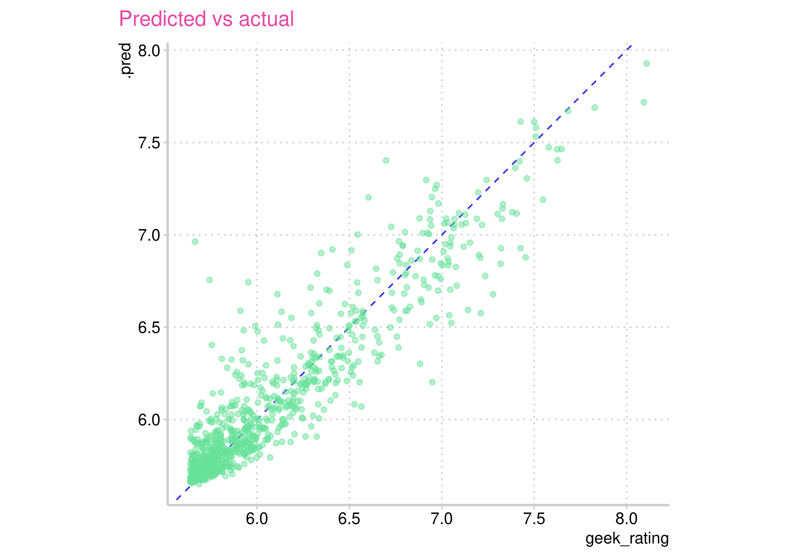

# Apply to new data


```r
have_scored <- cbind(to_score, predict(ranger_fit$.workflow[[1]], to_score)) %>%
  select(game_id, geek_rating = .pred)
```

# Output submission


```r
write_csv(have_scored, 's01e01/submission.csv')
```

# Outcome

While this was a late submission, the RMSE for my submission was **0.17972**, which would put me about 10^th^ on the private leaderboard

# Possible improvements

- Try different model types
- Is there a better way to create flags for the categories and mechanics - yes using the textrecipes package
